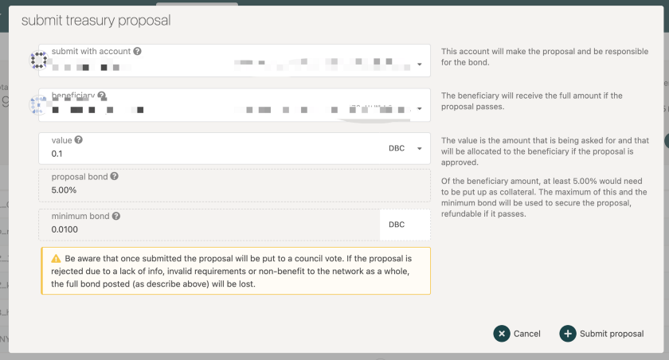
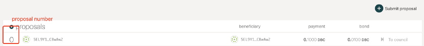
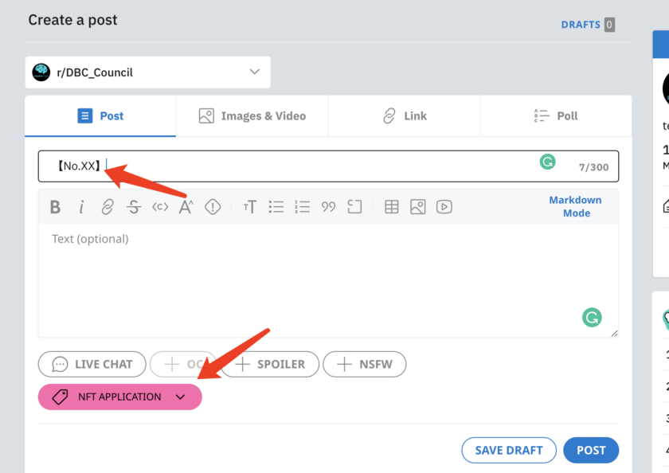

# How to apply for DBC NFT from DBC Council?

As DeepBrain Chain community self-governance system has launched, and the award of the DeepBrain Chain NFT medal has been handed over to DBC Council. This year the council can award up to 2 gold NFT medals, 20 silver NFT medals and 200 bronze NFT medals.

Community members who want to apply for DBC NFT can apply according to the following process.

1. Submit a proposal on-chain on the page [DBC mainnet-governance-treasury] (https://www.dbcwallet.io/#/treasury), with a value of 0.1DBC and a binding of 0.01DBC. After submission, you will get a number of the proposal on the chain.

2. Organize your application materials, such as contributions to the community and related certificates, and post to the subreddit community of the DBC Council https://www.reddit.com/r/DBC_Council/, add the on-chain number of the proposal to the title, and Add flair【NFT Application】. At the same time, please attach your email address to facilitate follow-up contact.

3. Waiting for on-chain voting by the council. If the proposal is passed, DBC foundation will be responsible for issuing the NFT to you.

More about DBC NFT:

NFT medal is the highest honour of the DBC community and is divided into gold, silver and bronze, which are awarded to members who have made outstanding contributions to the DBC community. These medals can be repurchased by the Foundation.

Gold medals are awarded to community members who have made outstanding contributions to the community; silver medals are awarded to community members elected as supernodes, important computing power suppliers, computing power promotion platforms (users), technical developers, media partners, etc.; bronze medals are awarded to offline volunteers, community members who actively promote the project, DBC “die-hard fans”, the first batch of AIM buyers, etc.

The Foundation will conduct a buyback in January each year and will destroy them afterwards. Gold coins are redeemable for 1,000,000 DBC, silver coins for 100,000 DBC, and bronze coins for 10,000 DBC. The buyback deadline is December 31, 2026 BST.
