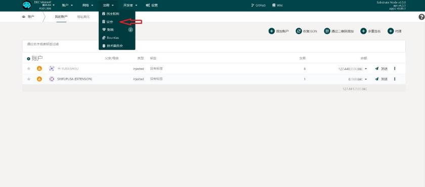

# DBC 이사회 선거 프로세스

https://t.youku.com/yep/page/m/957gtxr1a1?wh_weex=true&isNeedBaseImage=1&objectType=1&objectCode=1450996867&sharekey=50ac9db00159ca59a635d9ef76a7041a5

이미지 버전:

우선 Polkadot 기반 DBC 메인넷 지갑을 가지고 있어야 합니다. 지갑을 만든후 DBC 메인넷 주소 www.dbcwallet.io를 열고 "거버넌스" 클릭합니다.

"의회"표시됩니다

클릭후 현재 의회 선거 상태 볼수있습니다

"의석"--현 이사회 구성원

"runners up"--일시적으로 탈락한 후보자 (준우승)

"후보자"--후보자 제출후 일시적으로 20위안에 못들어간 참가자들

페이지 우측상단에 "투표" 및 "후보자제츨" 있습니다

이사회 선거참여 할려면 "후보자제출"으로 이동, 투표만 하려면 "투표"로 이동합니다 .

**A.우선"투표" 단계 확인합니다**

클릭후 자체 계좌 잔액 확인합니다

1개DBC 는 1표입니다,주의사항: DBC가 1개 미만일 경우 투표 불가입니다

확인후 사인하여 제출, 비밀번호 입력하면 됩니다

**B.다음은 "후보자 제출 "확인합니다**

입력 후 선거 참여할 계정을 선택하세요.

"후보 자격 바인딩"은 기본적으로 선거 자격을 얻기 위해 10,000개DBC로 바인딩됩니다.

제출 클릭후 온체인 등록 확인되면, "투표" 단계로 돌아가서 스스로에게 투표할 수 있습니다.

투표는 특정 계좌에 보증금을 입금하는 방식으로 이루어지며,

보증금이 많을수록 당첨 확률이 높아집니다

물론 당신이 커뮤니티에서 높은 명성을 얻고 투표를 받을수 있는 강력한 능력이 있다면 모든 사람을 동원하여 자신에게 투표하도록 할 수 있습니다. ——이상은 이사회 선거에 참여하기 위한 모든 전략입니다.

포인트: 투표를 하든 선거를 하든 노드 기존노드에 담보된 보증금을 해제할 필요가 없으며, 수익 및 선거 모두 동시 진행 가능합니다 !

---

DBC 메인넷이 Polkadot으로 완전히 전환된 후 커뮤니티 민주적 거버넌스의 추진이 현재 주요 행사가 되었습니다.

DBC 재단은 매달 425만 개 DBC를 온체인 기금을 투입하며, 전부 커뮤니티가 사용할 거버넌스 기금으로 사용됩니다.

DBC 커뮤니티의 모든 구성원은 커뮤니티의 생태적 발전에 유익한 일을 하기 위해 거버넌스 기금을 신청할 수 있습니다.기금은 이사회 투표 통해 통과하면 얻을 수 있습니다.
