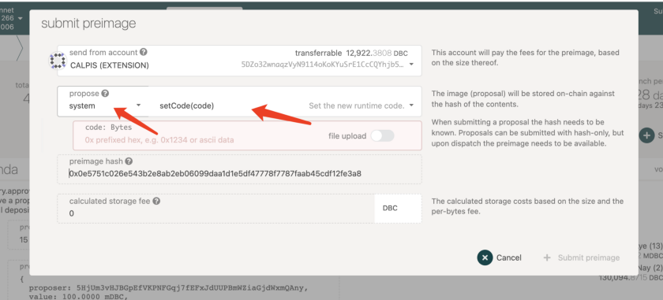
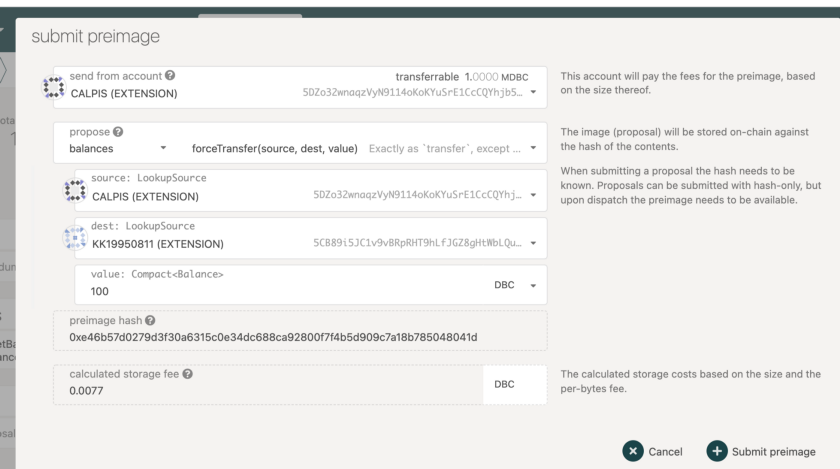
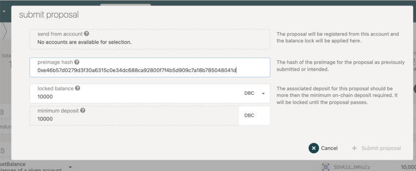
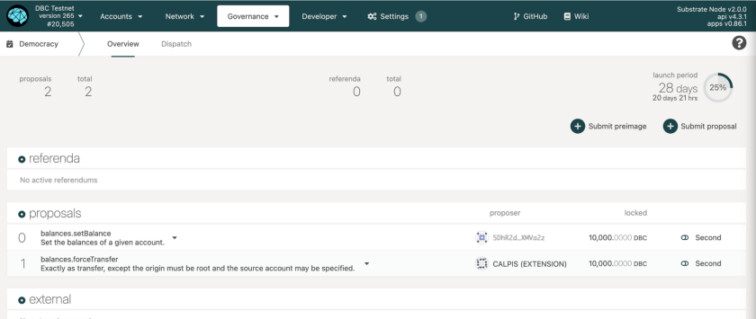
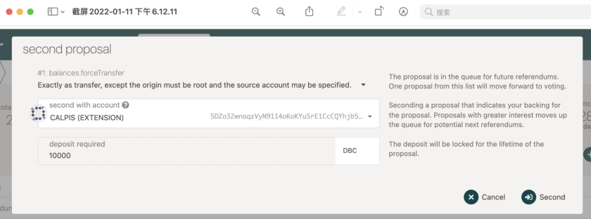
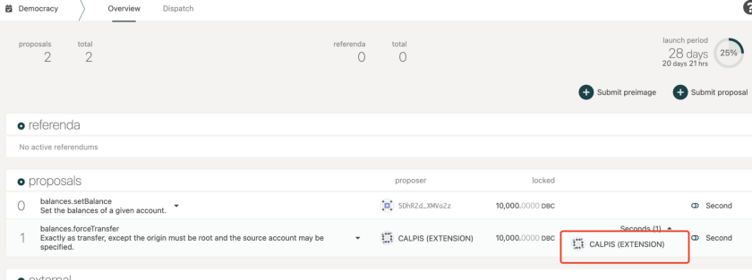

# 메인넷 퍼블릭 투표방법

퍼블릭 투표는 제안에 대한 대중 공개 투표 입니다. 거버넌스 결정은 제안서로 시작하여 , 대중 퍼블릭 투표를 통해 성립됩니다.여기서 제안은 계정 잔액 설정, 강제 이체 등과 같이 사용자가 직접 접촉 불가한 일련의 특권 기능 중 하나일 수 있습니다. 대중투표 제안은 대중 공개 제출, 이사회 제출 등에서 나올 수 있습니다. 여기서는 주로 대중이 퍼블릭 투표를 시작할 수 있는 방법을 소개합니다.

여기에서 제안하는 것은 계정 잔액 설정, 강제 이체, Galaxy Race에 의해 활성화된 GPU 수, GPU 컴퓨팅 성능 가격 등과 같이 사용자가 직접 만질 수 없는 특권 기능 그룹 중 하나일 수 있습니다.

일정 기간 동안 최소한의 DBC를 예금하여 누구나 국민투표를 시작할 수 있으며 , 전체 프로세스는 [프리 이미지 제출]-[제안서 제출]-[ 제안 최다 보조모션 얻음]-[퍼블릭 투표 진행]을 포함합니다 .

## 1.프리 이미지 제출

제안서 제출전 제안자는 사전 이미지 먼저 제출 해야합니다 .

[프리 이미지 제출]클릭

제안서 내용에 따라 system선택 , 관련 파라미터 기입, 이후 프리 이미지 해시를 복사합니다 .

예)누군가 강제 이체를 시작하려면 시스템에서 "잔액"을 선택하고 표시되는 파라미터를 입력한 후 프리 이미지 해시를 복사해야 합니다 .

## 2.제안서 제출

사전 이미지 제출 후 , [제안서 제출]클릭, 이전 단계 보사한 이미지 해시를 여기에 기입합니다 .

제안서 제출후 , [제안]에서 제출한 제안서 확인 가능합니다 .

Reddit 커뮤니티에 더욱 상세 제안서내용을 동시에 게시하시면 좋습니다 .https://www.reddit.com/r/DBC_Council/

## 3.보조 모션

28일마다 대중에서 한 발의안, 즉 [보조모션] 가장 많은 발의안만 대중투표에 참여할 수 있습니다. 당신이 지지하고 일정량의 dbc를 보증하면 더 빨리 대중투표에 참여하도록 돕고 싶다면 [보조모션] 기능을 사용할 수 있습니다. 보증걸어둔 dbc는 퍼블릭 투표 진행시 잠금 해제됩니다.

작업 완료후, 여기서 보조모션이 표시 됩니다

## 4.거버넌스 메커니즘에 대한 추가 내용

DBC 메인넷은 Polkadot substrate 기반으로 개발되었으며 거버넌스 메커니즘은 Polkadot과 유사합니다. 거버넌스 메커니즘에 대해 상세 내용은 하기 링크 참고 부탁드립니다 :

https://mp.weixin.qq.com/s/K3_ISFO2Zhi5Uh3s07rWUQ(중문)

https://wiki.polkadot.network/docs/learn-governance#referenda(영문)

https://wiki.polkadot.network/docs/maintain-guides-democracy(영문)
