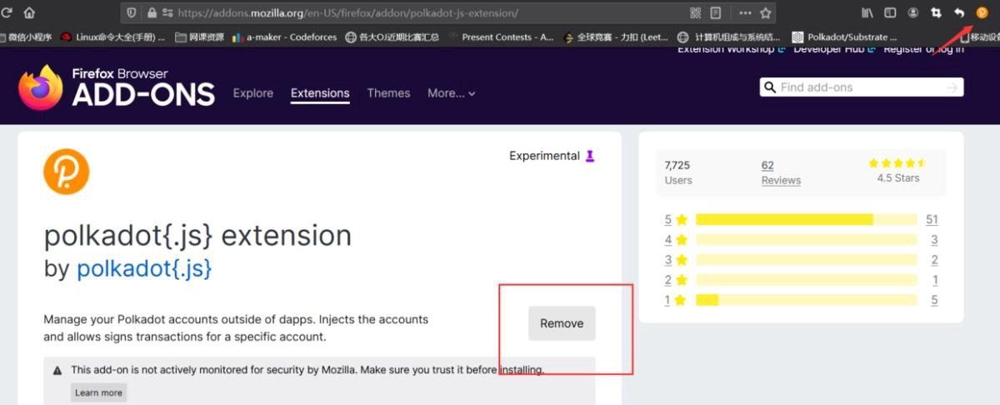
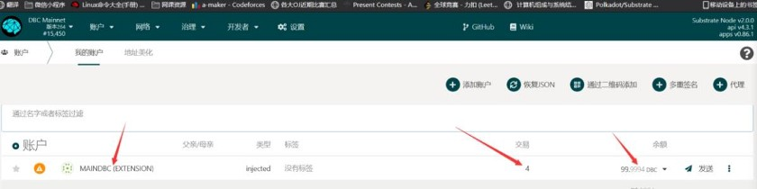
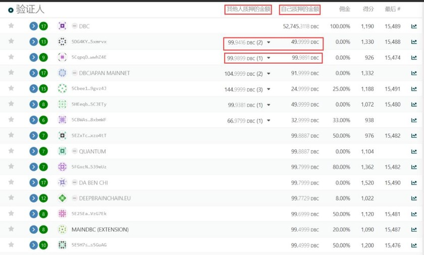
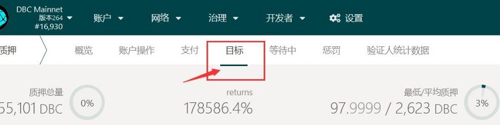
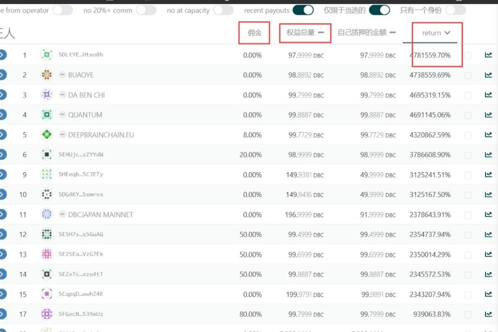
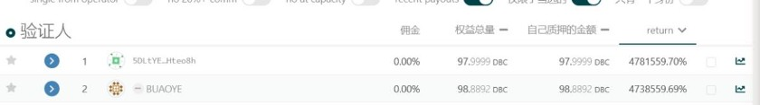
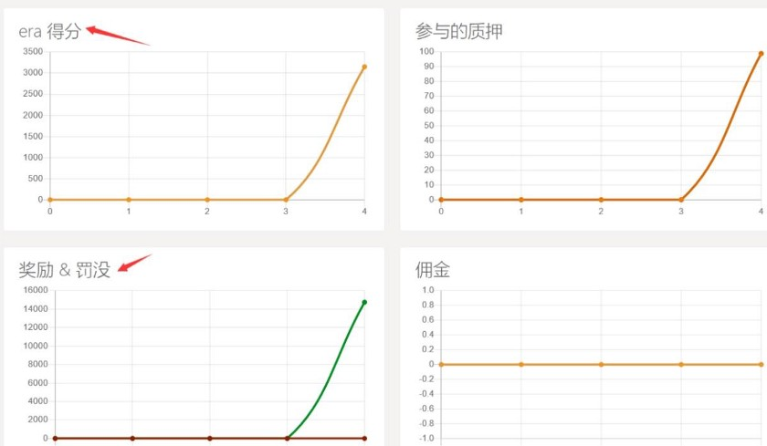
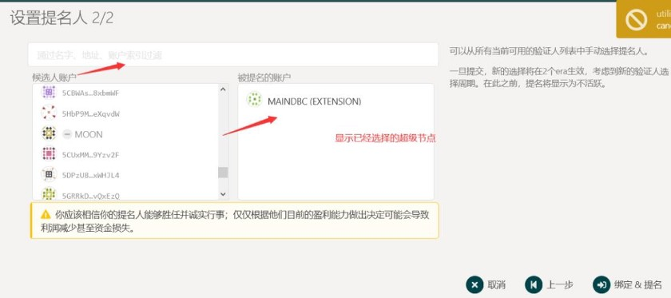
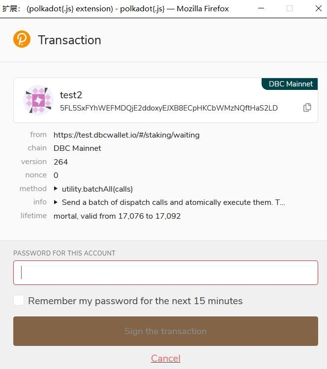
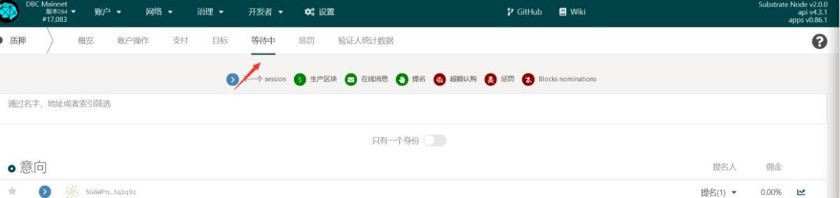

# 슈퍼노드 투표 프로세스

> DBC 계정 생성, 보증, 슈퍼노드 선거 투표 프로세스 :https://bit.ly/3eAVQeU
>
> DBC슈퍼노드 선거보증, 투표링크:https://www.dbcwallet.io/#/staking/actions

딥브레인체인 DBC 보유자는 지갑에서 노드 보증 수익을 얻을수있는 방법 무엇인가요?

영상 링크 참고 :https://v.qq.com/x/page/d3247jd4vjb.html?url_from=share&second_share=0&share_from=copy

## A.사전 준비

1.사용가능한 컴퓨터 준비.

2.dbc 지갑 백업을 위한 니모닉, 가지고 있지 않아도 상관없습니다. 하기 내용중 메인넷에서 새 지갑을 만드는 방법 프로세스 있습니다.

3.구글 브라우저 이용.

4.Polk Js 지갑 플러그인 설치.

플러그인 다운로드 주소 :https://addons.mozilla.org/en-US/firefox/addon/polkadot-js-extension/

링크 클릭후 하기 파란색 네모 클릭 , 이하는 추가 완성후 페이지 입니다 .

파란색 네모칸이 하얀색으로 변경하면, 우측상단 레드 화살표 표시됩니다, 즉 플러그인 추가 완성 된것입니다 .

## B.도입(혹은 생성) 딥브레인체인 메인넷 지갑

이전단계 완료되면 플러그인 아이콘 클릭하여 메인넷 지갑 생성할 수 있습니다.

상기 니모닉은 매우 중요합니다, 안전한 곳에 필수로 백업해주세요 . 기록후 next step 클릭하여 비밀번호 설정합니다 .

설정이 완료되면 다음 단계로 이동합니다. 플러그인 아이콘을 클릭하면 자체 딥브레인체인 지갑주소 확인할수있습니다.

## C:DeepBrain Chain 메인넷 스테이킹 프로세스 , 검증인 노드 지명(슈퍼노드 스테이킹)

주의:

▶여기에 슈퍼노드를 스테이킹하는 것은 투표 수익을 얻기 위해 모든 사람이 참여할 수 있는 방식으로,서버와 같은 하드웨어 리소스가 필요하지 않으며 모든 사람이 일정량의 dbc를 보유하고 있으면 됩니다.

▶여기에서는 마이닝 스테이킹에서 발생할 수 있는 몇 가지 함정과 추후 스테이킹 기술을 소개하여 모든 사람이 가능한 한 동일한 양의 dbc를 스테이킹하여 최고의 수익을 얻을 수 있도록 하는 방법을 소개합니다.

1.딥브레인체인 메인넷 주소 클릭 https://www.dbcwallet.io/#/explorer

클릭후, 여러분 지갑 주소와 지갑 잔액을 확인할 수 있습니다 .

이후 네트웍 스테이킹 클릭하여 슈퍼노드 리스트 정보 확인할 수 있습니다.

1분기에는 21개의 슈퍼노드가 있고, 주회측은 3개의 노드를 점유하지만, 슈퍼노드의 수량이 18개 이상일 경우 주최측 노드는 중지됩니다, 이후 분기마다 10개의 노드가 추가되어 현재 총 41개 노드 있습니다 . （https://dbc.subscan.io/validator）

현재 41개의 슈퍼노드의 상황을 분석해 보겠습니다 .

주의:

슈퍼노드는 24시간마다 선출되며, 영원한 슈퍼노드는 없습니다. 슈퍼노드의 총 보증량에 따라 슈퍼노드 선정될 수 있으며, 최종 상위 41개는 별도의 조작 없이 자동으로 슈퍼노드로 선정됩니다.

슈퍼노드 페이지에서 자신과 타인이 보증한 금액의 합이 가장 큰 41개의 노드가 슈퍼노드로 선정되는 것을 알 수 있습니다, 또한 선거에 참여하고 싶은 다른 노드도 있지만, 이번 선거 종료 혹은 순위가 41위 뒤로 되여 이 페이지에 나타납니다.

목표 클릭, 선거 참여하는 모든 슈포노드 확인 가능합니다. 다음은 슈퍼노드 데이터 분석을 통해 어떤 수퍼노드에 스테이킹해야 매일 수익 얻고 , 수익 최대화 할수있는지 확인합니다.

모든 슈퍼노드 확인후 , 하기 데이터 분석이 필요합니다

주의:

return:계정의 dbc에 따라 노드를 스테이킹 하면 얻을 수 있는 수익을 말하며, 클릭 후 리턴이 표시되지 않는 경우 리턴을 클릭하면 자동으로 순위별로 정렬됩니다.

스테이킹 총량: 자신 및 타인 스테이킹 DBC 총량 입니다, 이 데이터를 보고 41위 슈퍼노드로 선정됩니다 .

커미션:즉, dbc 네트웍은 매일 같은 양의 dbc를 선정된 슈퍼노드에 보냅니다, 슈퍼 노드는 네트웍 블록을 검증하기 위해 서버가 필요합니다. 모든 슈퍼 노드는 자체적으로 커미션 비율을 설정할 수 있습니다.커미션이 높을수록 슈퍼노드는 더많이 얻게 됩니다, 그럼 슈퍼노드에 스테이킹 한사람은 얻는게 줄어듭니다, 총수량은 한정되있습니다.

더욱 쉽게 이해하기 위해 , 하기 예제 참고바랍니다 :

dbc 메인넷은 매일 41개 조각 케이크를 사용자를 위해 준비하고 3개는 팀 자체를 위해 준비하고 나머지 41개는 메인 네트웍의 스테이킹 사용자가 41개의 케이크를 나눌 수 있도록 합니다. 그러나 어떻게 공정하고 설득력이 있게 나눌 수 있을까요? dbc는 수없이 많은 팀장을 설정합니다, 즉 슈퍼노드입니다 . 단 케이크는 41개만 있으며 이 모든 팀장들이 레이스에 참여하여야 합니다. 어떻게 당신이 선출될 수 있다고 보장할 수 있습니까? 이는 수테이킹 총계에만 달려 있습니다. 자체 보유 수량 및 타인 스테이킹 DBC총량입니다 순위는 41위 안에 들어야합니다 . 41순위에만 드면 다른 작업 없이 무조건 슈퍼노드로 선정 됩니다, 유일하게 운영해야 하는 것은 슈퍼 노드가 주요 커뮤니티에 투표 지원 요청 하거나 자체 dbc를 더욱 많이 보유하는 것입니다. 즉 다음 라운드를 보장하기 위해 상위 21위 안에 들어야 케이크를 나눌수있습니다 .

추가질문, 케익은 있는데 어떻게 나누는지? 슈퍼노드네 투표 후 나의 수익은 어떻게 계산되는지 알아봅니다.

우선, dbc 메인 네트웍은 이 케이크를 슈퍼 노드에 보냈습니다, 즉, 슈퍼 노드는 매일 약 6772개 (41노드일 경우) dbc를 받습니다. 하기 페이지의 데이터는 슈퍼 노드를 더 잘 필터링하는 데 도움이 될 수 있습니다.

**[출처]** [슈퍼노드 투표 프로세스](https://blog.naver.com/dbc_korea/222643200202)|**작성자** [DBC KOREA](https://blog.naver.com/dbc_korea)

​

케익 얻을(DBC) 계산 공식=(케익 총량*(1-커미션)*(자신이 노드에 스테이킹한 DBC 총량 대비 비율))

팁: 슈퍼노드 수입은 두가지에 얻습니다 , 첫째,자체 설정한 커미션 비율\*얻은케익(dbc)총량+케익총량*(1-커미션)*(슈퍼노드의 dbc가 총량대비 비율))

이 공식을 여러분께 설명하겠습니다. 가장 먼저 봐야 할 것은 커미션 아래 숫자입니다. 이 비율은 슈퍼노드 자체설정합니다. 예를 들어 0%로 설정하면 슈퍼노드가 이 케이크를 얻은 후에는 이부분은 받지 않겠다는 의미입니다,즉 슈퍼노드는 dbc 보상받은후 스테이킹자들과 공유하고 그들의 dbc 보유량에 따라 비율따라 공평하게 나눕니다 . 그러나 기본적으로 모든 노드는 이 커미션 비율을 0%로 설정하지 않습니다. 커미션 비율이 높을수록 슈퍼 노드가 더많은 수익을 얻을수있습니다 . 예 , 이 비율을 100%로 설정하면 이슈퍼노드는 스테이킹 자에게 케이크 한 조각을 주지 않을 것이고, 이런 노드에게는 아무 소득도 얻지 못하기 때문에 그냥 무시하시면 됩니다.

단 커미션 비율만 보지는 않습니다, 여러 데이터로 분석후 선별해야합니다 .

따라서 인과 관계는 커미션과 자신이 스테이킹한dbc 총량대비 비율이 최종 수익을 결정합니다 , 즉 return 크기 입니다.

주의:스테이킹할 때 수익률에 따라 정렬한 후 상대적으로 수익률이 높은 상위 21개를 선택한 다음 일부 신뢰할 수 있는 노드를 선택합니다.왜 신뢰할 수 있는 노드를 선택할까요? 일부 노드는 처음에 볼 때 수수료 비율이 매우 낮게 설정하거나 0으로 설정합니다, 이는 일부 스테이킹자를 유도할려는 행위입니다, 처음 계산 시 수익률이 높아지지만 이후 슈퍼 노드로 선출되면 커미션비율을 변경할 수 있습니다. 즉 슈퍼노드가 얻는 dbc를 늘리면 다른 사람들은 자연스럽게 훨씬 적게 받게됩니다. 따라서 우리는 수익을 이전 수익보다 적지만 안정적임을 보장할 수 있도록 신뢰할 수 있는 노드를 찾아야 합니다. 이를 위해서는 우리가 투표하는 슈퍼 노드를 검증 하기위해 , 공식 커뮤티니에 가입하여 지켜보고 소통해야합니다 .

고래해야 할 또 다른 조건은 슈퍼 노드의 기기 상황 입니다 .

이 곡선 아이콘을 클릭하면 몇 가지 처벌과 보상을 볼 수 있습니다. 곡선의 일부가 갑자기 자주 떨어지는 경우이 슈퍼 노드가 자주 처벌 받는것을 의미합니다. 처벌을 받으면 오늘의 수익이 훨씬 적음을 의미합니다.

하기 슈퍼노드에 대해 분석 완료후 구체적인 투표 프로세스 입니다 .

한도액을 정할때 전부 스테이킹 하지 말고 네트웍 이체을 위해 일부 dbc를 남겨 두세요 .

계속 다음단계 클릭하여 하기 페이지 화면에 비밀 번호 입력하시면 됩니다 .

스테이킹 완료되면 목록에서 자신이 스테이킹한 슈퍼노드의 대기 정보를 확인할 수 있으며, 다음 선거에서 담보로 지정된 슈퍼노드가 당선될 경우 해당 보상을 받을 수 있습니다.
