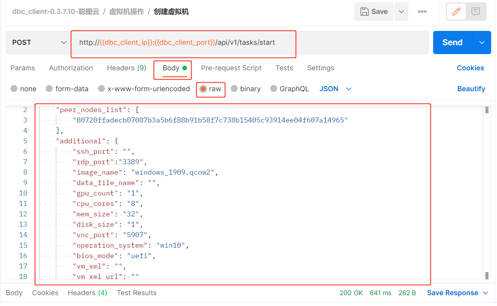
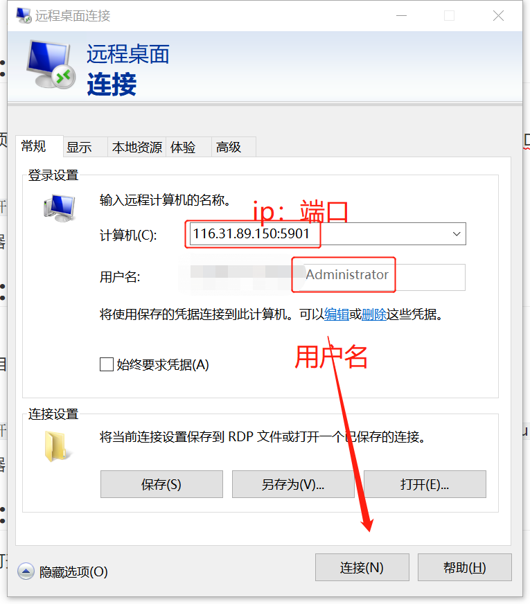
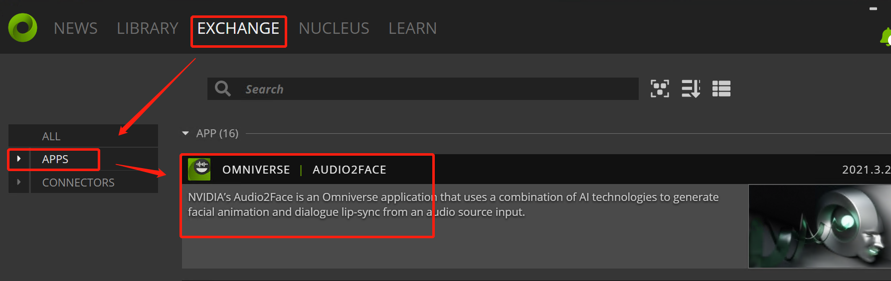

# windows가상기기 만들기(omniverse응용)

---

## 단계1 : 임대 확정 기기

- 메인넷 지갑 열기

https://www.dbcwallet.io/?rpc=wss://info.dbcwallet.io#/explorer

- 지갑 만들기:계정-->계정추가 (니모닉 워드는 꼭 잘 보관하세요, 니모닉 워드 분실 경우 계정도 다시 찾을수 없습니다, 코인도 분실됩니다)

- 갤럭시레이스목차 클릭하여, 필요한 유휴기기 찾습니다.

https://galaxyrace.deepbrainchain.org/table


## 단계2:온첸인 기기 임대

- 개발자---거래---rentMachine ----rentMachine(machine_id, duration) 순차적 클릭

- machine_id 임대할 기기id 입력，입력 칸 안에 0x 우선 삭제 필요합니다

- duration임대 일수 입력

- 입력 완료 후 거래 제출 클릭, 30분안에 기기 사용 가능여부 확인. ( 30분내 임대 확인 불가이면, 지불한 dbc는 환불 됩니다 . 하지만 거래 수수료 10개 dbc는 환불 불가입니다 )

- windows 가상기기 만들기:

​

방식 요청 ：POST

URL 요청：http://<dbc_client_ip>:<dbc_client_port>/api/v1/tasks/start

body 요청 ：

```json
{
  "peer_nodes_list": [
    // 기기의node_id 요청
    "58fb618aa482c41114eb3cfdaefd3ba183172da9e25251449d045043fbd37f45"
  ],

  "additional": {
    "ssh_port": "",
    //원격등록시 인지한 포트(가상기기별 다른 값 설정)
    "rdp_port": "3389",
    //가상기기 이미지명(가상기기 혹은 이미지 관리중심에 이미지명 보유 확보)
    "image_name": "windows_1909.qcow2",
    // 데이터디스크 이름 입력(입력 안해도 됩니다, dbc입력안하면, 인지한 형식은data_1_<task_id>.qcow2의 이름 존재 , 입력하면, 파일 존재여부 검사,존재하면 데이터디스크는 파일의 예.qcow2형식 존재)
    "data_file_name": "",
    // gpu수량（ 0보다 크거나 같음）
    "gpu_count": "1",
    // cpu수량（0보다 큰）
    "cpu_cores": "8",
    // 메모리 사이즈（0보다큰，단위：G）
    "mem_size": "32",
    // 디스크 사이즈（0보다 큰，단위：G）
    "disk_size": "1",
    // vnc사용하여 가상기기 포트 넘버 연결 （가상기기 별 다른 값 설정）
    "vnc_port": "5907",
    // windowns 시스템(필수)
    "operation_system": "win10",
    "bios_mode": "uefi",
    "vm_xml": "",
    "vm_xml_url": ""
  },
  "session_id": "임대자 배포한session_id",
  "session_id_sign": "임대자 배포한session_id_sign"
}
```

예 :


- 설정에 따라 만드는 과정 시간 차이가 있습니다,대략 5분에서 15분사이에 완성 됩니다

- 가상기기 상세 정보 요청 통해 , 가상기기 등록방식 및 가상기기 현재 상태 확인할 수 있습니다 (상태값이"creating'일경우, 가상기기 현재 만드는 중으로 의미됩니다 )

관련 작업 참고:

https://github.com/DeepBrainChain/DBC-DOC/blob/master/creat_macine/create_macine.md

## 단계 3:가상기기 원격 연결

- 가상기기 등록 방식 확인후,현지에서 원격연결 열기

  

## 단계4: 사용가능 확인 후 임대

::: warning
확인전 가상기기 정상 작동 여부 꼭 확인하세요 . 임대확인 완료 후 기기 임대완료 되며,DBC임대료는 환불 안됩니다
:::

- 개발자----거래----rentMachine----confirmRent(machine_id)순차적으로 진행하세요

- 기기 id 입력 및 거래 제출 하세요

## 단계 5: omniverse다운로드 Audio2Face설치

- NVIDIA홈페이지 열어 NVIDIA omniverse다운 받습니다 ：https://www.nvidia.cn/omniverse/#

- 홈페이지 문서참고하여 설치 하십시오:EXCHANGE(거래소),Apps（응용）부분에서 Audio2Face찾음,이후 순차적으로 “Install”（설치）및“Launch”（작동）설치합니다。

  

- 작동후 ,기본인지 아바타와 함께 제공되는 음성 및 템플릿 파라미터를 볼수있습니다 (템플릿 엔진을 로드하는데 몇분 정도 소유 됩니다 )

더많은 관련 작업 참고:

https://docs.omniverse.nvidia.com/app_audio2face/app_audio2face/overview.html


단계 6: 기기 추가 임대

::: warning
기기 만료되면 가상기기는 자동으로 중지됩니다,만료되기 전에 추가 임대가 하십시오
:::

- 개발자----거래----rentMachine----reletMachine(machine_id, add_duration) 순차적 클릭

- 기기id 및 추가 임대 일수 입력, 거래 제출합니다
