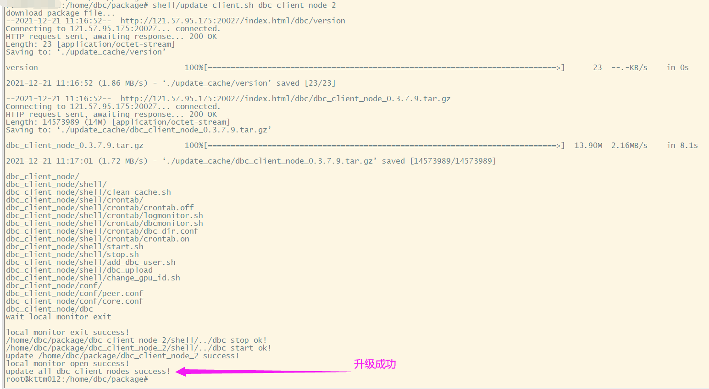

# DBC고객측 설치 및 업그레이드

고객측 노드의 역할

- DBC 고객노드는 전체 네트워크에서 신뢰할 수 있는 사람의 역할을 하며 현재 네트워크에서 기능 노드를 올바르게 배포하는 기기를 검색가능합니다. 기능 노드가 배포된 후 http를 통해 고객노드를 요청하여 당신의 기능 노드가 고객 노드에 성공적으로 연결되었는지 확인할 수 있습니다. 고객 요청을 통해 기능 노드의 기기 ID를 성공적으로 볼 수 있으면 기능 노드를 성공적으로 배포했음을 의미합니다.

- 제안: 주최측에서 제공되는 고객 노드는 온라인에서 영원히 안정적인 상태를 유지할 수 없으므로 각 컴퓨팅풀은 백업을 위해 두 개의 고객 노드를 구축하길 권장합니다, 동시에 DBC 네트워크 확장에 도움이 됩니다.

- 팁: 고객노드는 하드웨어 장치에 대한 요구가 매우 낮으며, 공용 네트워크를 통해 액세스할 수 있는 한 정상적으로 실행할 수 있는 모든 공용 네트웍 서버로 구축할 수 있습니다,메모리도 거의 차지하지 않습니다.

## A. DBC고객측 설치

​설치 환경
sudo apt-get install libvirt-clients libvirt-daemon-system expect -y

1. 설치 스크립트 다운로드： http://119.6.235.169:9000/dbc/install_update_script/mainnet/install_client.sh

​2. install_client.sh 스크립트 문서에 집행 권한 추가 ：

chmod +x install_client.sh`

​3.스크립트 설치 운행:

./install_client.sh [설치목차]`

설치 과정에서 사용자는 2개의 포트 번호를 입력해야 합니다

## B. DBC 고객측 업그레이드

1. 업그레이드 스크립트 다운로드:

http://119.6.235.169:9000/dbc/install_update_script/mainnet/update_client.sh

2.update_client.sh 스크립트 문서 진행권한 추가 ：

chmod +x update_client.sh`

3.업그레이드 스크립트 운행:

./update_client.sh [설치목차]`

