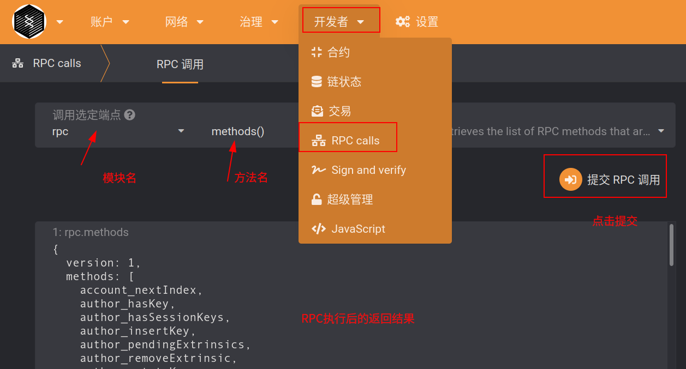

# DBC-Blockchain mainnet RPC description

## 1. RPC description

### 1.1 Applicable version

This document applies to dbc mainnet, mainnet branch [`master`](https://github.com/DeepBrainChain/DeepBrainChain-MainChain)，websocket： `wss://info.dbcwallet.io`

### 1.2 Build your own RPC node

In addition to using the `websocket interface` provided by DBC, you can also build your own sync node and use the `websocket` or `HTTP interface` provided by your own node to obtain data.

```bash
# Rust compilation environment
curl https://getsubstrate.io -sSf | bash -s -- --fast
source ~/.cargo/env

# compile dbc-chain
git clone https://github.com/DeepBrainChain/DeepBrainChain-MainChain.git && cd DeepBrainChain-MainChain
git checkout v2.3
cargo build --release

# run sync node：
./target/release/dbc-chain --base-path ./db_data --pruning archive --rpc-cors all --no-mdns

# Port：
--rpc-port 9933   # Specify the port on which your node listens for RPC. 9933 is the default value, so this parameter can also be ignored
--ws-port 9945    # Specify the port your node uses to listen for WebSocket. The default port is 9944
--port 30333      # Specify the node port you use to listen for p2p traffic. 30333 is the default port, if you don’t need to change it, you can ignore this flag
```

After running the sync node in the above method, you can call the websocket interface through `ws://127.0.0.1:9945`, and call the http interface through `http://127.0.0.1:9933`.

If you want to access remotely, you need to configure the domain name for websocket or http to support `wss` or `https`

Example of using the HTTP interface to obtain data, you can view `dbc_chain_rpc.postman_collection.json` in this folder, and import Postman for viewing.

### 1.3 RPC request format

```json
{
  "jsonrpc": "2.0",
  "id": 1,
  "method": method_name,
  "params": [params_1, params_2, ...]
}
```

Among them, `method_name` is the name of the RPC method, and params_1, params_2... are replaced with the required parameters.

For example, use Postman to connect to websocket to query `block information`:

> Postman creates websocket API: https://blog.postman.com/postman-supports-websocket-apis/
>
> 

### 1.4 How to access historical data on the chain

In 1.3, the acquired data is the current state of the chain. If you want to get the status at a certain time in the past, you need to pass in the Hash of the corresponding block at a certain time.

If you want to view the data two days ago, add the block Hash two days ago to the last parameter of the "params" field of the post request.

### 1.5 RPC documents not included

This document only contains the DBC mainnet **`custom RPC description`**, if you want to view **`Polkadot native RPC document description`**, you can refer to: https://polkadot.js.org/ docs/substrate/rpc/;

### 1.6 View all supported RPC methods

Go to the dbc web wallet: https://www.dbcwallet.io/, click on the left to switch networks, and in the custom terminal, enter the websocket address. Then navigate to `RPC calls` as shown below to view all RPCs supported by the blockchain. As shown in the figure, select the `methods` method of the `rpc` module, click on the right side of `Submit RPC Call`, and all RPC method names will be listed.



## 2. **About `Block height`, reward distribution time, and description of `Era`**

The block height is the time on the chain.

### 2.1 Get the current block height

- Methods： `chain_getBlock`

- How to call：

  ```json
  {
    "jsonrpc": "2.0",
    "id": 1,
    "method": "chain_getBlock",
    "params": []
  }
  ```

- Result：

  ```json
  {
    "jsonrpc": "2.0",
    "result": {
      "block": {
        ...
        "header": {
          ...
          "number": "0x2d8",
          "parentHash": "0xc0e1b239fafc0edf3e08a908b5caecb27c2b351ed0daef3fc60c5600b28d6d7d",
          "stateRoot": "0x55ce4794b2cdd21275656a80febf5133d882d909a2de6d40d7b8887bd65628bc"
        }
      },
      "justification": null
    },
    "id": 1
  }
  ```

  "number": "0x2d8" is block height. Convert to decimal ：728

### 2.2 Era and reward distribution time

- 1 Era is 2880 blocks in height, which is about 1 day on the DBC blockchain. The time for issuing rewards is the time interval of the block chain height `[2880*n, 2880*n+60]`.

- Machines that go online on the nth Era will be issued at the end of n+1 Era. That is, if the machine that goes online on Era2 is [5761, 8640], the rewards will be issued in the interval of 60 blocks before the start of Era4, that is, the rewards of Era3 will be distributed when `2880*4=11520`. You can check the rewards of Era3 later, for example, through the erasMachineReleasedReward method, check the rewards obtained by era3 machines.

- On the current mainnet, [529920, 532800] is Era1, and [532801, 535680] is Era2...
