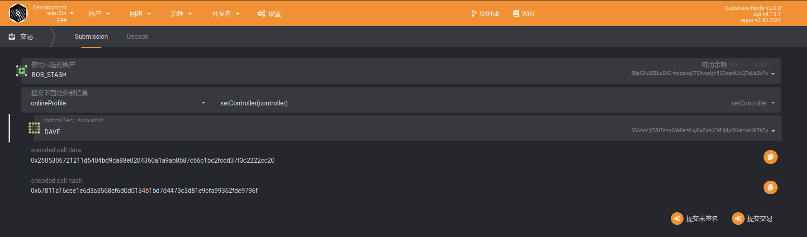
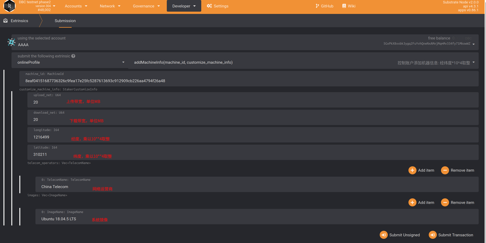
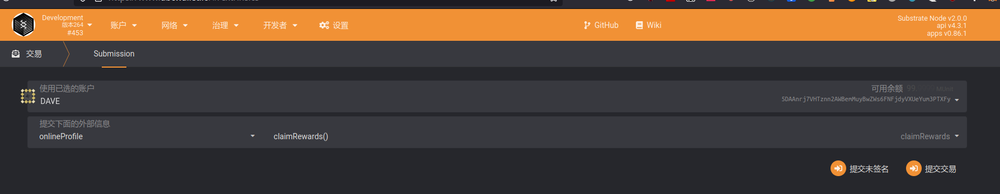

# Machine Onchain steps

## Method 1: Binding via web wallet

### 0. Ready to work

- Make sure DBC client is installed on the machine.

- Before bonding GPU Machine online, please make sure you have enough balance in your wallet. (Each GPU need to stake 1000 DBC).

## Stash account binding control account

### 1.1 Description：

- For the safety of your account funds, we strongly recommend using a multi-signature account as a capital account. For multi-signature accounts, please go to https://github.com/DeepBrainChain/DBC-DOC/blob/master/DBC_install/%E5%A4%9A%E9%87%8D%E7%AD%BE%E5%90%8D%E8%B4%A6%E6%88%B7.md

- The `Stash Account`: When the GPU machine is bound onchain, the DBC will be staked from the `Stash Account`, and when the rewards are distributed, it will be issued to the `Stash Account`.

- `Control account` is the manager, responsible for the operation of the machine, maintenance, etc.

- The `control account` also needs some DBC, and some transaction fee generated by the operation on the chain will be deducted from the `control account`.

### 1.2 Operation

Navigate to: `Developer`--`Transaction`, as shown below, select the `setController` method of the `onlineProfile` module, select your `stash account` and `control account` respectively, and click bind in the lower right corner



> As shown above, BOB_STASH account (`Stash account`) set DAVE account as `control account`.
>
> `Stash Account`: `5HpG9w8EBLe5XCrbczpwq5TSXvedjrBGCwqxK1iQ7qUsSWFc`
>
> `Control account`: `5DAAnrj7VHTznn2AWBemMuyBwZWs6FNFjdyVXUeYum3PTXFy`

### 1.3 Check whether the stash account and control account are successfully bound

Query whether the stash account and the control account are successfully bound: as shown in the figure below, when the stash account is successfully bound to the control account, you can select `controllerStash` of the `onlineProfile` module through `Developer`--`Chain Status`, to query the stash account corresponding to the `control account`. In the figure below, a stash account corresponding to a control account is queried.


## 2. The machine generates a signed message

> You need to use the machine's private key to generate a signed message and send it to the chain to confirm the stash account own this machine.

### 2.1 Query `Machine ID` and `Machine Private Key``

You need to query the machine private key on the machine where the DBC client program is installed. And use the private key to generate a signed message and send it to the chain.

```shell
# The machine ID and private key are in the directory of the dbc installation program, such as:
# /home/dbc/0.3.x.x/dbc_repo/dat/node.dat
# Its content is:
node_id=8eaf04151687736326c9fea17e25fc5287613693c912909cb226aa4794f26a48          # Machine ID
node_private_key=398f0c28f98885e046333d4a41c19cee4c37368a9832c6502f6cfd182e2aef89 # Machine private key
```

### Use `machine private key` to generate signature data

Use the following [script](https://github.com/DeepBrainChain/DeepBrainChain-MainChain/blob/master/scripts/test_script/gen_signature.js) to generate signature data.

```shell
#Instructions
1. Install nodejs 14 on the linux server (the version must be 14, otherwise there will be other errors, please Google for the installation method)
2. Clone script: git clone https://github.com/DeepBrainChain/DeepBrainChain-MainChain.git
3. Installation: cd DeepBrainChain-MainChain/scripts/test_script && npm install
4. Execute the script
node gen_signature.js --key 0x398f0c28f98885e046333d4a41c19cee4c37368a9832c6502f6cfd182e2aef89 --msg 8eaf04151687736326c9fea17e25fc5287613693c912909cb226aa4794f26a485CiPPseXPECbkjWCa6MnjNokrgYjMqmKndv2rSnekmSK2DjL

### Message: 8eaf04151687736326c9fea17e25fc5287613693c912909cb226aa4794f26a485CiPPseXPECbkjWCa6MnjNokrgYjMqmKndv2rSnekmSK2DjL
### Signer: 8eaf04151687736326c9fea17e25fc5287613693c912909cb226aa4794f26a48
### Signature: 0x5cc8b4c49b244d7c071b124ef68119d7549dd805ea43f69e3c142fd5909f926041a9cad93b16085d72431df2d1164e7911085423bca16625295583686f2fce8c
```

> `--key` specifies `machine private key`,
>
> and **key is prefixed with 0x**;
>
> `--msg` specifies the message that needs to be signed, and the message content is `machine ID+fund account`;
>
> The data after `Signature:` is the **signature data**.

### 2.3 Use `Control Account` to bond machine to stash_account

Now, we need to broadcast the **_signature data_** generated in the previous step through the `control account`.

Navigate to: `Developer`--`Transaction`, and select the `bondMachine` method of the `onlineProfile` module as shown below. Use `Control Account` to bind `Machine ID` (`MachineId`) with `Control Account`. Fill in the parameters as shown below:


### 2.4 Query whether the machine is successfully bound:

After completing this step, you can query the machines in the system through `Developer`--`Chain Status`--`onlineProfile`--`liveMachines`. As shown in the figure below, a machine is queried that has been bound. Next, you need to add machine information


## 3. `Control account` need to generate "computer room"

### instruction

**When the stash account is bound to the machine for the first time or the machine is in a new computer room**, a new computer room ID needs to be generated. A transaction fee of `10 DBC` is paid for each generation of a computer room.

If the machines to be bound are in the same computer room, just generate the computer room information once. If the machines are in different computer rooms, the corresponding number of computer rooms will be generated according to the situation. When adding machine information, select the corresponding computer room (if the machines are in the same computer room, you can add the same computer room ID each time you add machine information).

### 3.1 Operation: Generate new room information on the chain


### 3.2 Query the computer room records generated under the stash account

Navigate to `developer`--`chain status`, through `stash account`, view the computer room bound under **stash account**: the following figure generates two computer rooms, and the query parameter is the fund account.


## 4. `Control account` add machine information

`Control account` also needs to add machine information: Navigate to `Developer` -- `Transaction`--`onlineProfile`--`addMachineInfo`



- Parameter description:

  - server_name: Select the computer room ID generated in the previous step

  - upload_net: upload bandwidth (take 20MB bandwidth as an example, fill in 20).

  - download_net: download bandwidth (take 20MB bandwidth as an example, fill in 20).

  - longitude: Longitude. Take the East longitude 131.1548123 as an example, fill in `East 1311548`. Be careful not to fill in the longitude and latitude upside down. The error can be within the range of 30 km, and the staking will be deducted if the content is wrong).

  - latitude: Latitude. Take south latitude 121.143253 as an example, fill in `South 1211432`. Be careful not to fill in the longitude and latitude upside down.The error can be within the range of 30 km, and the pledge will be deducted if the content is wrong.

  - Computer room network information, you can choose from the following according to the situation: (China Mobile: China Mobile, China Unicom: China Unicom, China Telecom: China Telecom, non-Chinese operators fill in according to their actual names.The pledge will be deducted if the content is wrong)

## 5. Check and receive rewards

### 5.1. Check rewards

In the developer--chain status, select: the `stashMachines` method of the `onlineProfile` module, fill in the parameters in **`stash account`**, you will be able to find the detailed information of the reward for the `stash account`.

Among them, `can_claim_reward` is the reward that can be claimed, and `left_reard` is the remaining part of the reward obtained every day before (the remaining 75%, this 75% will be released in the subsequent 150 antennas).


### 5.2. Collect rewards

Use **Control Account** to claim reward, and rewards will be issued to **`Stash Account`**.



## 6. Query the machine bounded to the account

- View the machines on the chain under the fund account: Navigate to `Developer`----`Chain Status`----`Storage`----`onlineProfile`----`stashMachines`

- View the machines on the chain under the control account: Navigate to `Developer`----`Chain Status`----`Storage`----`onlineProfile`----`controllerMachines`
