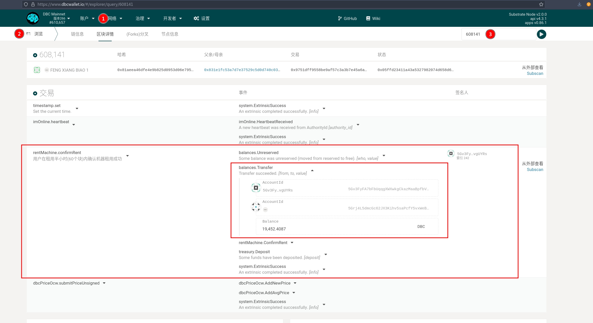

# Query machine historical orders and rent

Ideas:

For a machine, it can be rented after the start of the chain. After the lease, the lease can be renewed before the lease term expires. Therefore, there are two moments for the deposit payment: 1. After being rented, when the lease success method is called; 2. During the renting process, when the lease renewal method is called.

The two method calls are: `rentMachine-confirmRent` and `rentMachine-reletMachine`.

For example, you can go to subscan to find all confirmed lease transactions.

As shown in the figure, the machine `12481de9a6d9abe7b8a0c8771b0db0e948333101b6c49b80470d955745c0407d` can be checked for lease at 608141.

By querying the transaction of 608141:

It can be queried that the user of 5Gv3Fy...vgUYRs called `Confirm Rent`. After executing the call, the pledged amount is transferred to the stash account of the machine.
