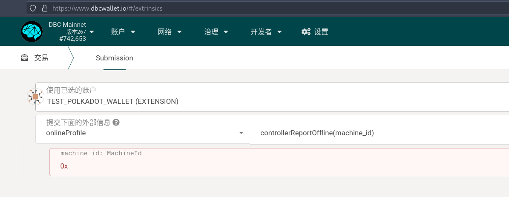
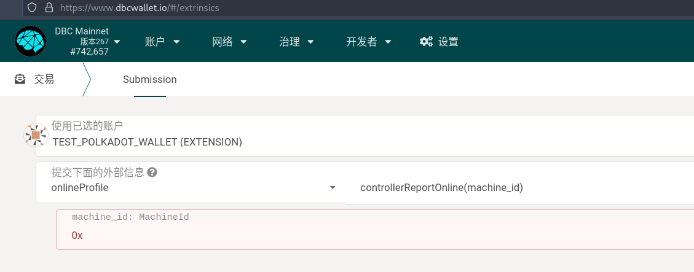

# Machine offline steps

::: warning Attention!
⚠️ Incorrect machine-offline may result in penalty of staking!
:::

Machine offline is divided into two cases: `offline due to malfunction` and `offline due to the need to change the hardware`.

- offline due to malfunction

1. If there is a malfunction of the machine, in order to avoid punishment by the renter reporting, it is necessary to use the control account to report the machine offline to the chain to deal with the malfunction. After the malfunction processing is completed, it can be reported to the chain to go online.

2. If the machine needs to be permanently offline, the control account can report the machine offline to the chain.

- offline due to need to change hardware

When the machine hardware changes, in order to make the online and offline info consistent and avoid being reported and punished, the machine needs to actively report to request the onchain info change. At this point, machines will be randomly assigned to validators to submit new machine configurations to the chain.

## Machine offline due to malfunction

Depending on the state of the machine (rented | free), going offline has different penalties. Refer to the amount of punishment [when the operator sends the offline notification actively](https://deepbrainchain.github.io/DBC-Wiki/en/onchain-guide/machine-slash-model.html)

The offline duration and free duration (since the end of the last rented) have an impact on the penalty amount. **If machine is free for more than 10 days, there will be no penalty after going offline. The staking of the machine can be returned after 365 days from the first online**

After going offline, you can go online and/or permanently offline. If it is not online for more than 10 days, it will be processed as if it was offline for 10 days.

### offchain operations

Go to Developer--Transactions, select machine `Control Account`, and execute the `controllerReportOffline` method of the `onlineProfile` module. As shown below:

### On-chain operations after going offline

Go to Developer--Transactions, select `Control Account`, and execute the `controllerReportOnline` method of the `onlineProfile` module. As shown below:

## The machine is offline due to the need to change the hardware

TODO
