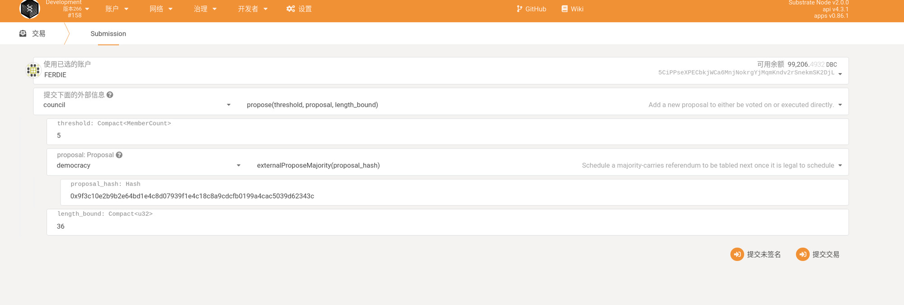
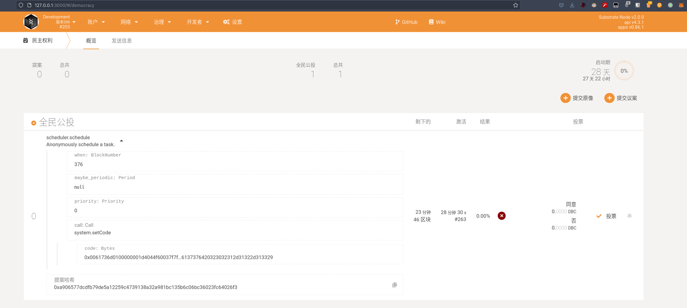

# Fast-track Process

Note: The screenshots are all from testnet. The values in it need to be filled in according to the situation after reading this document. Please do not fill in directly according to the picture.

1. (Any account can) Go to the Preimages page, submit the preimage, as shown below, and copy the "preimage hash". As shown in the figure, the code is upgraded.

After filling in the parameters, the pre-image hash is: `0xbb3e3bd46891ad75a32fa62a3897fb6374665943aca58cb2b2f91c401fadd2dd`

2. Council members execute the following calls: Note that `MemberCount` at least 3/4 of council members (e.g. there are 21 council members, MemberCount should be at least 16), and the proposal_hash fills in the Hash generated and copied in the previous step

3. The council will vote, and click close when all are passed

Then, the store can be queried:

4. The technical committee proposes motion, Note: the threshold needs to be the number of all technical committees.

Among them, voting_period is the duration for voting, which is filled in according to the actual situation. The voting start time is the time when the technical committee executes the close after the voting is completed.

`delay` is the delay time for code execution after voting ends.

After the execution is as follows:

5. Call on the technical committee to vote. After the voting is completed, click "Close"

6. After the technical committee votes, the referendum will be opened, and the pass condition is "simple majority".

As shown in the figure below, the rest is the remaining time for voting. Activation is the execution time of the code after the vote is passed.

After voting, you will see the code to be executed in the dispatch queue:

