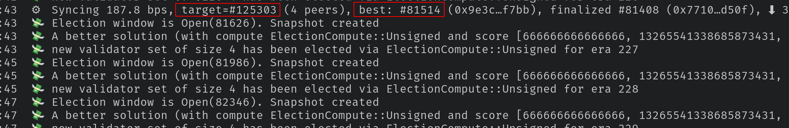
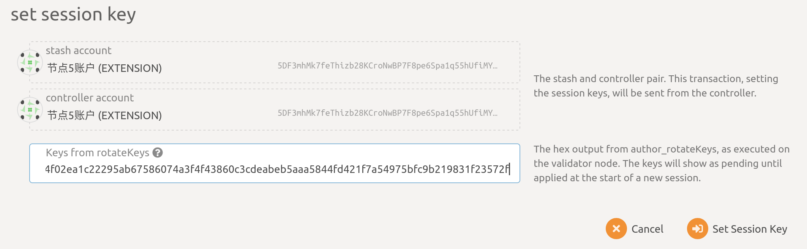

# How to run as DBC validator?

## 0. Recommended hardware

- RAM：8G
- CPU：2 cores
- Disk：100G
- OS: ubuntu20.04 ++

## 1. Generate stash account

（If you already have stash account, you can skip this）

Reference: [Generate new dbc account](generate-new-account.md)

## 2. Get `dbc-chain` binary

### Option 1: use pre-build version (recommended)

> If any errors, please use Option 2

```bash
mkdir dbc-chain-mainnet && cd dbc-chain-mainnet
wget https://github.com/DeepBrainChain/DeepBrainChain-MainChain/releases/download/v2.3/dbc_chain_linux_x64.tar.gz -O dbc_chain_linux_x64.tar.gz

tar xf dbc_chain_linux_x64.tar.gz
```

### Option 2: compile from source

```bash
# install dependency
curl https://getsubstrate.io -sSf | bash -s -- --fast
source ~/.cargo/env

# compile dbc-chain
git clone https://github.com/DeepBrainChain/DeepBrainChain-MainChain.git
cd DeepBrainChain-MainChain && git checkout v2.3
cargo build --release
```

### 3. Synchronize Chain Data

```bash
./dbc-chain --base-path ./db_data --pruning archive
```

- If you compile from source, the binary path is `./target/release/dbc-chain`

- After finished synchronize, type `Control + C` to close the above command. You can compare `target` and `best` to infer if sync is finished. When `target` is closed (100 blocks, for example) to `best` , it can be regard sync is finished.



- **Flags in detail：**
  - `--base-path`：Specifies a directory where Substrate should store all the data related to this chain. If this value is not specified, a default path will be used. If the directory does not exist it will be created for you. If other blockchain data already exists there you will get an error. Either clear the directory or choose a different one.
    - `--chain ./dbcSpecRaw.json`：Specifies which chain specification to use.
    - `--pruning=archive`：synchronize chain data
    - `--bootnodes`：specified a single boot node. ( If you encounter a synchronization status of 0 peers, you can try to specify --bootnodes /ip4/122.99.183.53/tcp/3308/p2p/12D3KooWDx4pgzT2RAPF12QkmiBZy6BUsTtPt7JgiYxgFm6Z5Hc5 or other known synchronization nodes)

## 4.Then run the node as a validator:

When the dbc mainnet is upgraded to version 3.0, there will be many new features that are incompatible with the old version. In order to obtain staking rewards stably, please upgrade to version 3.0

```bash
# Execute in the folder generated in step 2
wget https://github.com/DeepBrainChain/DeepBrainChain-MainChain/releases/download/v3.2/dbc-chain-v3.tar.gz -O dbc_chain_linux_x64.tar.gz

tar xf dbc_chain_linux_x64.tar.gz

#Run verification node
# Query and stop the old version of the synchronization node
ps aux | grep dbc-chain

#The result is similar to the following display
root 761495 0.0 0.0 9584 2588 pts/0 S+ 17:07 0:00 grep --color=auto -w dbc-chain
root 926101 2.0 5.1 4295592 1650640 ? Sl 2023 5320:10 ./dbc-chain --base-path ./db_data --port 30337 --ws-port 9948 --rpc-port 9937 --pruning archive

# Stop old node
sudo kill -9 926101 (note to replace with the actual queried PID)

#Start new version node
nohup ./dbc-chain --base-path ./db_data --chain dbcSpecRaw.json --validator --name YourNodeName 1>dbc_node.log 2>&1 &

#If you encounter a startup error
./dbc-chain: /lib/x86_64-linux-gnu/libstdc++.so.6: version `GLIBCXX_3.4.30' not found (required by ./dbc-chain)
./dbc-chain: /lib/x86_64-linux-gnu/libstdc++.so.6: version `GLIBCXX_3.4.29' not found (required by ./dbc-chain)
./dbc-chain: /lib/x86_64-linux-gnu/libc.so.6: version `GLIBC_2.32' not found (required by ./dbc-chain)
./dbc-chain: /lib/x86_64-linux-gnu/libc.so.6: version `GLIBC_2.34' not found (required by ./dbc-chain)
./dbc-chain: /lib/x86_64-linux-gnu/libc.so.6: version `GLIBC_2.33' not found (required by ./dbc-chain)

#solution:
#1. Users in China:
echo "deb http://mirrors.aliyun.com/ubuntu/ jammy main" >> /etc/apt/sources.list
sudo apt update
sudo apt install libc6 libstdc++6 -y
#2. Non-China users
echo "deb http://archive.ubuntu.com/ubuntu/ jammy main" >> /etc/apt/sources.list
sudo apt update
sudo apt install libc6 libstdc++6 -y
```

- If you compile from source, the binary path is `./target/release/dbc-chain`
- You can give your validator any name that you like, but note that others will be able to see it, and it will be included in the list of all servers using the same telemetry server. Since numerous people are using telemetry, it is recommended that you choose something likely to be unique.

## 5. generate`rotateKey`

Run the following command in the terminal, and record the result.

```bash
curl -H "Content-Type: application/json" -d '{"id":1, "jsonrpc":"2.0", "method": "author_rotateKeys", "params":[]}' http://localhost:9933
```

## 6. Bond stash

- open [https://www.dbcwallet.io/?rpc=wss%3A%2F%2Finfo.dbcwallet.io#/accounts](https://www.dbcwallet.io/?rpc=wss%3A%2F%2Finfo.dbcwallet.io#/accounts) you will see your balance: 

- navigate to`Staking > Account actions`，click `stash`

- You should set bond balance（Make sure not to bond all your DBC balance since you will be unable to pay transaction fees from your bonded balance.）：

**Description：**

- `Stash account`：Select your Stash account. In this example, we will bond 45 DBC - make sure that your Stash account contains _at least_ this much. You can, of course, stake more than this.

- `controller account`：Select the Controller account created earlier. This account will also need a small amount of DBC in order to start and stop validating.

- `value bonded`：How much DBC from the Stash account you want to bond/stake. Note that you do not need to bond all of the DBC in that account. Also note that you can always bond _more_ DBC later.

- `payment destination`：The account where the rewards from validating are sent.

## 7. Set Session Keys

- After bond your stash，you can see in Polkadot UI `Session Key`button：

- click it and input the result in step 5`rotateKeys`

- Now, check in [Telemetry](https://telemetry.polkadot.io/#list/0xd523fa2e0581f069b4f0c7b5944c21e9abc72305a08067868c91b898d1bf1dff) and you can see your node.

## 8. Validate

- After steps above you can see`Validate` button and click it,


- You should set your preference as a validator.


- In `reward commission percentage` you should input your commission preference. Then clieck `Validate` to send this transaction。Then，in `Waiting` page，you are waiting status`Era` to be a validator.


## 9. Claim your rewards payout？

Navigate to `Staking > Payouts > Max, 84 eras` ，you may see all the rewards to be payout：


chick `Payout all` button to send a transaction.
