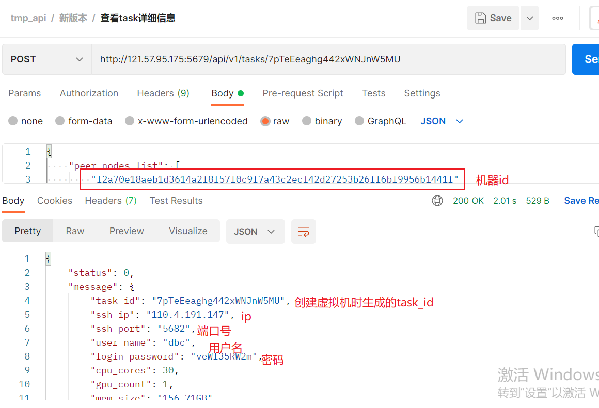
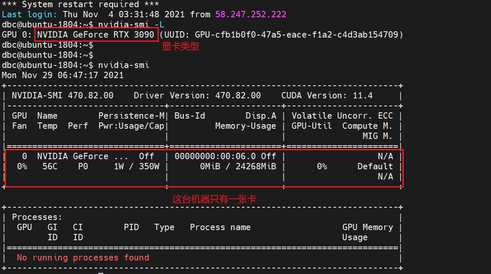
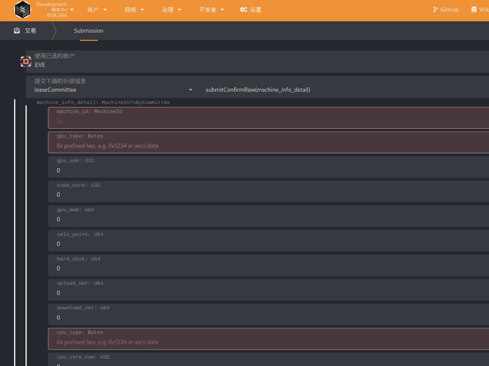

# 委员会验证机器

> 链上操作请到主网执行：https://www.dbcwallet.io/?rpc=wss://info.dbcwallet.io#/explorer

## 1. 成为验证委员会成员

可以通过社区投票（提交议案）参加委员会。

## 2. 生成 box_pubkey 用于信息加密

委员会成员需要提交用于信息加密的公钥，才能正常的派单与抢单。

```bash
# 自行安装node.js v14
git clone https://github.com/DeepBrainChain/DeepBrainChain-MainChain.git && cd DeepBrainChain-MainChain
cd scripts/test_script/ && npm install

# 生成公钥，需要利用脚本，指定自己的私钥
node gen_boxpubkey.js --key "0x868020ae0687dda7d57565093a69090211449845a7e11453612800b663307246"
```

## 3. 链上添加 box_pubkey

生成了公钥之后，到`committee` --> `committeeSetBoxPubkey` 点击"提交交易"进行设定。

执行此步骤时，会质押 20000 DBC，每次被派单时，将会记录下“使用 1000 DBC”。完成派单任务，则退还"1000 DBC"


## 4. 查看系统分配给自己的订单

导航到 `开发者`-->`链状态`-->`存储`，在其中选择`onlineCommittee`模块的`committeeMachine`存储，点击右侧的`+`号，可以看到委员会的订单情况。如果所示，该委员会有一个系统分配的订单


## 5. 查看系统分配给该委员会进行验证的时间区间

导航到 `开发者`--`链存储`--`存储`，选择`onlineCommittee`的`committeeOps`方法，并输入自己的委员会帐号，与上一步委派的机器 ID，可以查询到类似下面的信息：


其中，booked_time 表示派单时间，注意，派单之后的 36~48 小时(也就是区块高度 booked_time + 4320 ~ booked_time + 5760)之间，委员会提交原始信息。

`verify_time` 表示系统分派的，委员会验证机器信息的开始时间。如图，该委员会被分派了 9 次机会来验证机器，每次持续时间为 4 个小时，也就是 480 个块高。此时，委员会可以挑选自己方便的时间，通过前端查询该机器的登录信息，登录到系统中验证机器。

## 6. 查询机器信息

### 6.1 下载 Postman

下载安装 postman，具体下载请去官网根据操作系统安装。

下载 json 文件：http://114.116.21.175:22244/dbc-develop-0.3.7.5.postman_collection.json

导入 json 文件：fiel----import----选择 json 文件导入 import


将客户端 ip 地址以及端口更换为 `121.57.95.175:5679`

### 6.2 查看宿主机详细信息：

```shell
签名工具下载地址：https://github.com/DeepBrainChain/DBC-AIComputingNet/releases/download/0.3.7.3/sign_tool

# 安装依赖 libvirt：
## Ubuntu
sudo apt-get install libvirt
## Arch
yay -S libvirt

# 添加执行权限：
chmod +x sign_tool
 # 然后签名执行：
./sign_tool 钱包地址 钱包私钥
```


在下图中替换：sign、nonce、wallet （注意：同一个机器 sign、nonce 只能使用一次），可以查询到机器信息


查看机器 GPU 信息

### 6.4 创建虚拟机机器


创建过程比较慢，大约在五分钟到十五分钟之间，在 postman 的查看 task 详细信息查看虚拟机登录信息及虚拟机状态，如返回的结果中"status": "creating"表示虚拟机正在创建，此时等待即可



### 6.5 进入创建的虚拟机执行`nvidia-smi -L`查看显卡类型



查询完成后将虚拟机删除，出现 OK 说明删除成功


## 7. 委员会计算获得机器信息的 hash

我们已经提供了脚本来计算需要填写的信息的 Hash：

`https://github.com/DeepBrainChain/DeepBrainChain-MainChain/blob/master/scripts/hash_machine_info.py`

当获取到要求的信息后，修改该脚本，并执行，得到 hash 值。**请保存好所填写的信息，直到该机器上线成功，或者上线失败**

```bash
python3 hash_machine_info.py
```

## 8. 委员会提交机器信息的 Hash

如图，在 36 小时之前提交机器信息的 Hash(提交的时候要注意 0x 一定不能去掉)

注意：图片中，**leaseCommittee 替换成 onlineCommittee!!!** 其他不变。


## 9. 委员会提交机器的原始信息

**请确保提交机器原始信息时，在派单之后的 36~48 小时之间！**



## 10. 委员会奖励的查询与领取

### 10.1 查询奖励

导航到 开发者--链状态--存储，查询委员会帐号对应的奖励（committee 模块的 committeeStake 方法）。如图，其中`can_claim_reward`为可领取的奖励；`claimed_reward`为已经领取的奖励。


### 10.2 领取奖励

导航到 开发者--交易，选择委员会帐号，选择 committee 模块的 claimReward 方法，提交交易即可。


## 11. 其他操作 (TODO)

### 11.1 委员会添加质押

可以调用 `committee` --> `committeeAddStake` 方法。当(质押数量-已使用的质押) > 质押数量\*40%时，委员会状态为"可派单的"

### 11.2 委员会减少质押

### 11.3 查询惩罚(TODO)

委员会可以通过 开发者--链状态--选择 committee 模块的 pendingSlash 方法来查询奖励。其中，SlashId 为自增的，可以不包含该值，查询所有还没执行的惩罚。

如下图，可以查看惩罚金额(slash_amount)，原因(slash_reason)，惩罚执行时间(slash_exec_time)，惩罚产生时间(slash_time)等信息。


注意，如果查看到为乱码，需要更新类型，类型文件：https://github.com/DeepBrainChain/DeepBrainChain-MainChain/blob/master/dbc_types.json

### 11.4 惩罚申诉
