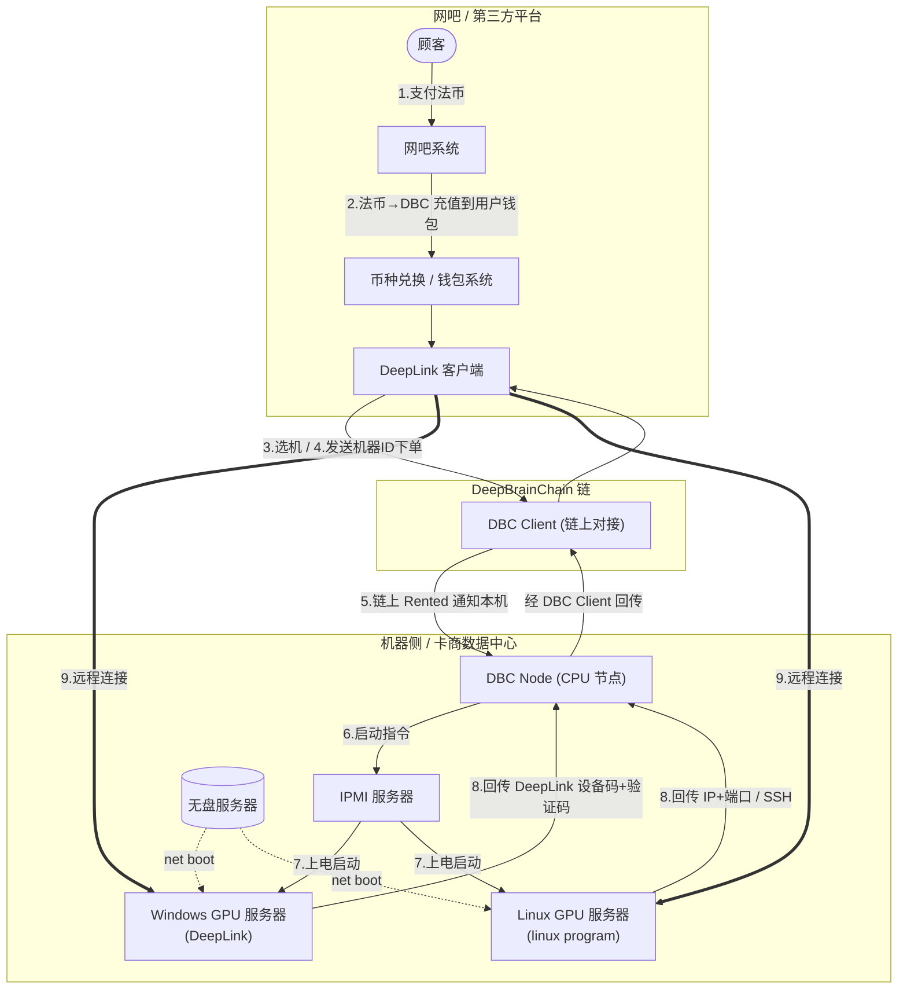

# DBC 链上「网吧模式」机器租用对接文档

> 面向第三方云平台 / 集成方 (third-party cloud platforms)
> 说明如何在 DeepBrainChain (DBC) 主链上**发现、租用、续租、查询**网吧模式（裸机 / 整机净启动）GPU 机器，以及租用成功后如何获得机器访问权。
> 链端一切操作均通过 Substrate RPC + `rentMachine` pallet 的 extrinsic 完成，无需任何中心化平台账号。

---

## 0. TL;DR（最短路径）

```
1. 连接 wss://rpc.dbcwallet.io（polkadot.js）
2. 查 onlineProfile.machinesInfo → 过滤 isBareMachine==true && machineStatus=="online" && 有空闲 GPU
3. 估算费用（USD 计价 → 实时换算成 DBC）
4. 签发 rentMachine.rentMachine(machineId, rentGpuNum, durationBlocks)   // 下单 + 预扣租金 + 10 DBC 手续费
5. 立即签发 rentMachine.confirmRent(rentId)                              // 确认 → 扣租金（95% 给卡主，5% 销毁）→ 机器进入 Rented
6. 机器节点检测到链上 Rented 后净启动/放行，租客拿到访问权
7. 到期前可 rentMachine.reletMachine(rentId, reletBlocks) 续租
```

---

## 1. 概念

| 概念 | 说明 |
|---|---|
| **网吧模式 / 裸机 (bare machine)** | 机器在上架时由卡主标记 `is_bare_machine = true`。这类机器以**整机净启动**方式出租，租客获得整台物理机的控制权（自行灌镜像 / 净启动），不是容器或虚拟机。适用于云游戏、网吧、渲染等需要独占裸机的场景。 |
| **链负责什么** | 机器发现、租用下单、计价与支付（DBC）、租期与状态记录。**全部在链上、可验证、去中心化。** |
| **机器节点负责什么** | 实际的开机 / 净启动 / 放行访问。机器本地的 DBC/DDN 客户端监听链上租用状态，检测到本机被某账户租用 (`Rented`) 后，为该租客提供访问（见 §7）。 |
| **计价货币** | 链上以**美元价值 (USD value)** 计价，下单时按 DBC 实时价格换算成 DBC 收取，因此**机器单价不随 DBC 币价波动**（USD 锚定）。 |

> 注意：网吧模式机器与「AI 容器 / 虚拟机模式」是两条独立产品线。本文档只覆盖**链上租用**这一层，对所有模式的机器都适用；网吧模式的区别仅在于 (a) 用 `isBareMachine` 过滤发现，(b) 租后通过净启动访问（§7）。

---

## 1.1 整体流程（网吧模式端到端架构）

典型「网吧 / 云游戏平台」接入 DBC 网吧模式机器的端到端流程如下。**第三方平台 = 左侧「网吧 / DeepLink」一侧**：负责支付、法币→DBC、选机、链上下单、接收访问凭证、远程连接；**机器侧（DBC Node / IPMI / 无盘服务器 / GPU 服务器）由卡商 + DBC 提供，平台无需自建**。



| 步骤 | 动作 | 谁来做 | 对应章节 |
|---|---|---|---|
| 1 | 顾客向平台支付（法币） | 平台 | — |
| 2 | 平台**为每个用户生成对应 DBC 钱包**，收款后按价值给钱包充值 DBC | 平台 | §2.3 |
| 3 | 用户选择 GPU 机器 | 平台 UI / DeepLink | §3 |
| 4 | 平台用该用户钱包**在链上下单租用** | 平台 → 链 | §4 + §5 |
| 5 | 链上变 `Rented`，机器侧 DBC Node 监听到（machineId + renter） | 链 → 机器侧 | §6 |
| 6–7 | DBC Node 经 IPMI 上电、从无盘服务器净启动 GPU 服务器 | 机器侧 | §7 |
| 8 | 回传 DeepLink ID/密码 或 Linux SSH 信息给平台 | 机器侧 → 平台 | §7 |
| 9 | 用户远程连接到 GPU 服务器 | 用户 | §7 |

> **本文档的链上接口（§3–§6）覆盖步骤 3–6**；步骤 1–2（钱包/充值）由平台实现；步骤 6–9（上电/净启动/凭证回传/远程连接）由机器侧 DBC Node 自动完成。

---

## 2. 准备

### 2.1 链与节点

| 项目 | 值 |
|---|---|
| 网络 | DeepBrainChain Mainnet (Substrate) |
| WSS RPC | `wss://rpc.dbcwallet.io`（主）, `wss://rpc2.dbcwallet.io`, `wss://rpc3.dbcwallet.io`（备） |
| 出块时间 | **6 秒 / 块** |
| 原生代币 | DBC（**15 位小数**，`1 DBC = 10^15`，链上以最小单位计） |
| 浏览器 | https://www.dbcscan.io |

时间 ↔ 块高换算（重要，所有 `duration` 参数都用**块数**）：

| 时长 | 块数 |
|---|---|
| 30 分钟（最小租用粒度） | **300** |
| 1 小时 | 600 |
| 1 天 | **14400** |
| 7 天 | 100800 |

### 2.2 SDK

```bash
npm i @polkadot/api @polkadot/keyring
```

```js
import { ApiPromise, WsProvider } from "@polkadot/api";
import { Keyring } from "@polkadot/keyring";

const api = await ApiPromise.create({ provider: new WsProvider("wss://rpc.dbcwallet.io") });
await api.isReady;

const keyring = new Keyring({ type: "sr25519" });
const renter = keyring.addFromMnemonic(process.env.RENTER_MNEMONIC); // 租客账户（需有足够 DBC）
```

### 2.3 账户与余额

- 租客账户需持有：**租金（USD 价值换算成 DBC）+ 10 DBC 固定下单手续费 + 少量 gas**。
- 下单时租金会被**预留 (reserve)**，`confirmRent` 时正式扣除；若未在确认窗口内确认，可解除预留（见 §5.3）。

---

## 3. 发现可租用的网吧模式机器

### 3.1 机器信息存储

`onlineProfile.machinesInfo(machineId) -> MachineInfo`，关键字段：

```
machineStatus                                 // "online" | "rented" | "addingCustomizeInfo" | "reporterReportOffline" | ...
machineInfoDetail.committeeUploadInfo.gpuNum  // 整机 GPU 总数
machineInfoDetail.committeeUploadInfo.gpuType // GPU 型号
machineInfoDetail.committeeUploadInfo.calcPoint// 算力分（用于计价）
machineInfoDetail.stakerCustomizeInfo.isBareMachine  // ★ true = 网吧模式/裸机
machineInfoDetail.stakerCustomizeInfo.telecomOperators / longitude / latitude / uploadNet / downloadNet
machineStash                                  // 卡主（收租）账户
```

已租 GPU 数：`onlineProfile.machineRentedGpu(machineId) -> u32`
空闲 GPU = `gpuNum - machineRentedGpu`。

### 3.2 过滤逻辑

一台机器**可被网吧模式租用**需同时满足：

```
isBareMachine === true
&& (machineStatus === "online" || machineStatus === "rented")
&& (gpuNum - machineRentedGpu) >= 需要的 GPU 数
```

### 3.3 示例：列出可租裸机

```js
const ONE = 10n ** 15n; // DBC has 15 decimals (1 DBC = 10^15 base units)
const entries = await api.query.onlineProfile.machinesInfo.entriesPaged({ args: [], pageSize: 200 });
const bare = [];
for (const [key, val] of entries) {
  const m = val.toJSON();
  if (!m) continue;
  const cu = m.machineInfoDetail?.committeeUploadInfo || {};
  const sc = m.machineInfoDetail?.stakerCustomizeInfo || {};
  if (sc.isBareMachine !== true) continue;
  const status = typeof m.machineStatus === "string" ? m.machineStatus : Object.keys(m.machineStatus)[0];
  if (status !== "online" && status !== "rented") continue;
  const machineId = key.args[0].toHuman();
  const rented = (await api.query.onlineProfile.machineRentedGpu(machineId)).toNumber?.() ?? 0;
  const free = (cu.gpuNum || 0) - rented;
  if (free <= 0) continue;
  bare.push({ machineId, gpuType: hexToStr(cu.gpuType), gpuNum: cu.gpuNum, freeGpu: free, calcPoint: cu.calcPoint, stash: m.machineStash });
}
console.log(bare);

function hexToStr(h){ try { return Buffer.from(String(h).replace(/^0x/,""),"hex").toString("utf8"); } catch { return String(h); } }
```

---

## 4. 计价规则（USD 锚定）

下单时链上按以下公式计算：

```
// 1) 系统日单价（USD 价值）
standard = onlineProfile.standardGpuPointPrice()      // { gpuPoint, gpuPrice }  价格预言机
systemDailyValue = gpuPrice * calcPoint / gpuPoint * (rentGpuNum / totalGpu)

// 2) 卡主额外加价（可选，每 GPU/天的 USD 价值）
extra = onlineProfile.machineExtraPrice(machineId) * rentGpuNum

machineDailyValue = systemDailyValue + extra            // 每天的 USD 价值

// 3) 按时长折算
rentFeeValue = machineDailyValue * durationBlocks / 14400   // 14400 块 = 1 天

// 4) 换算成 DBC（按当前 DBC 价格，USD 锚定）
rentFeeDBC = DbcPrice.get_dbc_amount_by_value(rentFeeValue)
```

另收 **固定下单手续费 10 DBC**（`generic_func.fixedTxFee`，下单即扣，不退）。

`confirmRent` 时支付分配：**95% → 卡主（或卡主设置的独立收租钱包）**，**5% → 销毁**（`rentFeeDestroyPercent`，当前 5%）。

> 链上 RPC 也提供费用试算：`api.rpc.rentMachine.*`（如可用），或直接用上面公式本地估算。建议下单前用估算值确保余额充足。

---

## 5. 租用流程（核心）

### 5.1 第一步：下单 `rentMachine`

```
rentMachine.rentMachine(machineId, rentGpuNum, duration)
```

| 参数 | 类型 | 说明 |
|---|---|---|
| `machineId` | `MachineId`（机器 ID 字符串/bytes） | §3 查到的机器 |
| `rentGpuNum` | `u32` | 要租用的 GPU 数（≤ 空闲 GPU） |
| `duration` | `BlockNumber`（块数） | **必须是 300 的整数倍**（30 分钟粒度）；不超过 `MaximumRentalDuration` 天 |

行为：校验 → 扣 10 DBC 手续费 → 计算并**预留**租金 → 生成订单（状态 `WaitingVerifying`）→ 抛事件 `rentMachine.RentMachine`，其中含 `rentId`。

```js
await new Promise((resolve, reject) => {
  api.tx.rentMachine.rentMachine(machineId, 1, 300 /* =30min */)
    .signAndSend(renter, ({ status, events, dispatchError }) => {
      if (dispatchError) return reject(dispatchError.toString());
      if (status.isInBlock || status.isFinalized) {
        const ev = events.find(e => e.event.section === "rentMachine" && e.event.method === "Rent");
        if (ev) console.log("rentId =", ev.event.data[0].toString());
        resolve();
      }
    });
});
```

> 取 `rentId` 也可在下单后查 `rentMachine.userOrder(renterAddress)` 或 `getRentIds(machineId, renter)`（见 §6）。

### 5.2 第二步：确认 `confirmRent`

```
rentMachine.confirmRent(rentId)
```

- **必须在确认窗口 `WAITING_CONFIRMING_DELAY` 内调用**（下单后尽快确认，建议立即）。超时订单作废、预留释放。
- 行为：正式支付租金（95% 卡主 / 5% 销毁）→ 机器状态 `Rented`、订单状态 `Renting` → 抛事件 `ConfirmRent`。
- 确认成功后，机器节点即可检测到本机被租用并放行（§7）。

```js
await api.tx.rentMachine.confirmRent(rentId).signAndSend(renter, /* ...同上回调... */);
```

### 5.3 未确认 / 失败

- 未在窗口内 `confirmRent`：订单失效，之前预留的租金解除，10 DBC 手续费不退。
- 下单失败的常见原因见 §8 错误码。

### 5.4 续租 `reletMachine`

```
rentMachine.reletMachine(rentId, reletDuration)   // reletDuration 同样是 300 的整数倍块数
```

在租期结束前续租，按相同 USD 计价补扣 DBC。

### 5.5 绑定 EVM 地址（可选）

```
rentMachine.bondEvmAddress(...)   // 将租客的 EVM 地址绑定到租用记录，便于 EVM/DLC 侧集成
```

---

## 6. 查询订单与状态

| 查询 | 返回 |
|---|---|
| `rentMachine.rentInfo(rentId)` | `RentOrderDetail`：`machineId, renter, rentStart, confirmRent, rentEnd, stakeAmount, rentStatus, gpuNum, gpuIndex` |
| `rentMachine.machineRentOrder(machineId)` | 该机器的租单列表 + 已占用 GPU index |
| `rentMachine.userOrder(renter)` | 该账户的所有 rentId |
| `onlineProfile.machineRentedGpu(machineId)` | 已租 GPU 数 |
| `onlineProfile.machinesInfo(machineId)` | 机器状态/规格（§3） |

`rentStatus` 枚举：`WaitingVerifying`（已下单待确认）→ `Renting`（租用中）→ `RentExpired`（已到期）。

剩余时间 = `(rentEnd - 当前块高) × 6 秒`。

```js
const info = (await api.query.rentMachine.rentInfo(rentId)).toJSON();
const head = (await api.rpc.chain.getHeader()).number.toNumber();
const secsLeft = Math.max(0, (info.rentEnd - head) * 6);
console.log(info.rentStatus, "剩余", Math.floor(secsLeft / 3600), "小时");
```

---

## 7. 租用成功后如何访问机器（§1.1 流程图 步骤 5–9）

链只负责"谁租了这台机、租到什么时候"；**实际上电 / 净启动 / 下发访问凭证 / 远程连接由机器侧的 DBC Node 链下自动完成**。`confirmRent` 成功（机器 `Rented`、`rentInfo.renter` = 租客）后：

| 步 | 动作 | 主体 |
|---|---|---|
| 5 | 链上 `Rented` 被机器侧 **DBC Node（CPU 节点）** 监听到（machineId + renter） | DBC Node |
| 6 | DBC Node 向 **IPMI** 下发启动指令，给目标 GPU 服务器上电 | DBC Node → IPMI |
| 7 | GPU 服务器从 **无盘服务器 (Diskless Server) 净启动 (net boot)**：Windows 机起 DeepLink，Linux 机起 GPU 工作站 | IPMI / 无盘 |
| 8 | 访问凭证回传：Windows/游戏机 → **DeepLink 设备码 + 验证码**；Linux 机 → **IP + 端口（SSH / Windows 远程连接）**，沿 GPU 服务器 → DBC Node → DBC Client → 平台 返回 | 机器侧 → 平台 |
| 9 | 用户客户端凭凭证**直接远程连接**到 GPU 服务器 | 用户 ↔ GPU 服务器 |

要点：
- **链上 `Rented` + `renter` 是访问授权的唯一可信凭证**——机器侧 DBC Node 据此放行、上电、净启动。
- 机器的 **IP + 端口**也记录在链上机器信息中，可直接读取用于 SSH / Windows 远程连接；DeepLink 的**设备码 + 验证码**由裸机节点经 GPU 机与裸机节点间的 LAN TCP 服务自动同步获取（与官方 DBC-Wiki「DBC Bare Metal Node」页一致）。
- 裸机的**上架（卡商侧）**走 DBC Node 的 `/api/v1/bare_metal/add`（提供 UUID / IP / IPMI 等），与本文档的「租用侧」无关。
- 第三方平台需要实现的部分：(a) 为每个用户生成对应 DBC 钱包、收款后按价值充值 DBC（§1.1 步骤 1–2）；(b) 用该用户钱包完成 §5 链上下单+确认（步骤 4）；(c) 接收并向用户透传步骤 8 回传的访问凭证；(d) 提供远程连接客户端（步骤 9，如 DeepLink）。
- 机器侧（DBC Node / IPMI / 无盘服务器 / GPU 服务器）由卡商 + DBC 提供，平台无需自建。
- 步骤 8 凭证回传的具体网关协议按运营商 / DBC Node 版本而异；如需对接某台机器的 DBC Node 网关细节，请联系 DBC 团队获取该网关接口文档。

---

## 8. 错误码（rentMachine pallet）

| 错误 | 含义 |
|---|---|
| `MachineNotRentable` | 机器状态不可租（非 Online/Rented） |
| `GPUNotEnough` | 空闲 GPU 不足 |
| `OnlyHalfHourAllowed` | `duration` 不是 30 分钟（300 块）整数倍 |
| `OutOfRentalSchedule` | 不在机器允许出租的时段内，或时长 < 2 小时（分时段出租机器） |
| `InsufficientValue` | 余额不足以预留租金 |
| `PayTxFeeFailed` | 不足以支付 10 DBC 下单手续费 |
| `Overflow` / `GetMachinePriceFailed` | 计价/溢出错误 |
| `Unknown` | 机器或订单不存在 |

---

## 9. 完整示例（发现 → 租用 → 确认 → 查询）

```js
import { ApiPromise, WsProvider } from "@polkadot/api";
import { Keyring } from "@polkadot/keyring";

const ONE = 10n ** 15n; // DBC has 15 decimals (1 DBC = 10^15 base units)
const sign = (api, tx, who) => new Promise((res, rej) =>
  tx.signAndSend(who, ({ status, events, dispatchError }) => {
    if (dispatchError) return rej(new Error(dispatchError.toString()));
    if (status.isInBlock || status.isFinalized) res(events);
  }).catch(rej));

async function main() {
  const api = await ApiPromise.create({ provider: new WsProvider("wss://rpc.dbcwallet.io") });
  const renter = new Keyring({ type: "sr25519" }).addFromMnemonic(process.env.RENTER_MNEMONIC);

  // 1) 发现一台可租网吧模式机器（取第一台 free GPU 的裸机）
  const entries = await api.query.onlineProfile.machinesInfo.entriesPaged({ args: [], pageSize: 200 });
  let target = null;
  for (const [k, v] of entries) {
    const m = v.toJSON(); if (!m) continue;
    const sc = m.machineInfoDetail?.stakerCustomizeInfo || {};
    const cu = m.machineInfoDetail?.committeeUploadInfo || {};
    const status = typeof m.machineStatus === "string" ? m.machineStatus : Object.keys(m.machineStatus)[0];
    if (sc.isBareMachine === true && status === "online" && (cu.gpuNum || 0) > 0) {
      const rented = (await api.query.onlineProfile.machineRentedGpu(k.args[0].toHuman())).toNumber?.() ?? 0;
      if ((cu.gpuNum - rented) >= 1) { target = k.args[0].toHuman(); break; }
    }
  }
  if (!target) throw new Error("no rentable bare machine");
  console.log("租用机器:", target);

  // 2) 下单：租 1 卡，30 分钟（300 块）
  const evs = await sign(api, api.tx.rentMachine.rentMachine(target, 1, 300), renter);
  const rentEv = evs.find(e => e.event.section === "rentMachine" && e.event.method === "Rent");
  const rentId = rentEv.event.data[0].toString();
  console.log("rentId:", rentId);

  // 3) 立即确认
  await sign(api, api.tx.rentMachine.confirmRent(rentId), renter);
  console.log("确认成功，机器进入 Rented");

  // 4) 查询
  const info = (await api.query.rentMachine.rentInfo(rentId)).toJSON();
  console.log("订单:", info.rentStatus, "结束块高:", info.rentEnd);

  await api.disconnect();
}
main().catch(e => { console.error(e); process.exit(1); });
```

---

## 10. 速查表

**Extrinsics (`api.tx.rentMachine.*`)**

| 方法 | 参数 | 作用 |
|---|---|---|
| `rentMachine` | `(machineId, rentGpuNum, duration)` | 下单 + 预扣租金 + 10 DBC 手续费 |
| `confirmRent` | `(rentId)` | 确认支付，机器进入 Rented |
| `reletMachine` | `(rentId, reletDuration)` | 续租 |
| `bondEvmAddress` | `(...)` | 绑定 EVM 地址（可选） |

**Storage (`api.query.*`)**

| 查询 | 说明 |
|---|---|
| `onlineProfile.machinesInfo(id)` | 机器规格/状态/`isBareMachine` |
| `onlineProfile.machineRentedGpu(id)` | 已租 GPU 数 |
| `onlineProfile.standardGpuPointPrice()` | 计价预言机 `{gpuPoint, gpuPrice}` |
| `onlineProfile.machineExtraPrice(id)` | 卡主额外加价 |
| `rentMachine.rentInfo(rentId)` | 订单详情 |
| `rentMachine.machineRentOrder(id)` | 机器的租单 + GPU index |
| `rentMachine.userOrder(renter)` | 账户的所有 rentId |
| `generic_func.fixedTxFee()` | 固定下单手续费（10 DBC） |
| `onlineProfile.rentFeeDestroyPercent()` | 租金销毁比例（当前 5%） |

**常量**：出块 6s；30 分钟 = 300 块；1 天 = 14400 块；租金 USD 锚定；下单手续费 10 DBC；销毁 5%。

---

*本文档基于 DeepBrainChain 主网 runtime（rentMachine / onlineProfile pallet）。如 runtime 升级导致接口变化，以链上 metadata (`api.tx.rentMachine` / `api.query.onlineProfile`) 为准。*

---

## 附：数据来源与校验

- 本文档所有 **extrinsic 名 / 参数 / storage getter 均已对照主网实时 metadata 校验**（spec 411，`wss://rpc.dbcwallet.io`）：
  `rentMachine(machineId: Bytes, rentGpuNum: u32, duration: u32)`、`confirmRent(rentId: u64)`、`reletMachine(rentId: u64, reletDuration: u32)`、`bondEvmAddress(machineId: Bytes, evmAddress: H160)`。
- 本页为第三方对接的**完整集成参考**；Wiki 的 [on-chain rent 简版页](./rent-machine.md) 是面向个人用户的 UI 操作步骤，二者一致（均已更新为**按 GPU 数租用 + rentId 寻址**的当前接口：`rentMachine(machine_id, rent_gpu_num, duration)` / `confirmRent(rent_id)` / `reletMachine(rent_id, relet_duration)`）。
- 访问层（IPMI 上电、无盘净启动、DeepLink 设备码+验证码、IP+端口 SSH/Windows 远程）与官方 DBC-Wiki「DBC Bare Metal Node」页**一致**。
- 计价、确认窗口（30 分钟）、10 DBC 手续费、6 秒出块 / 300 块粒度等与官方 Wiki 一致。
