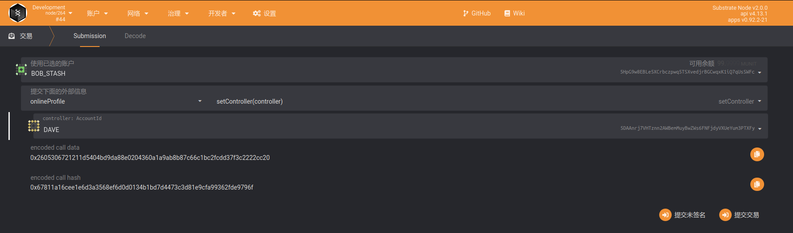
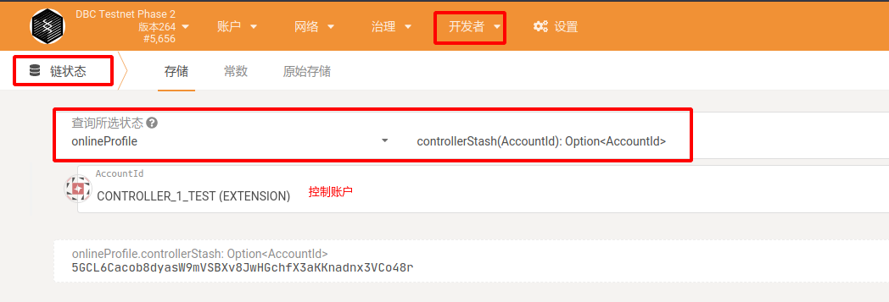
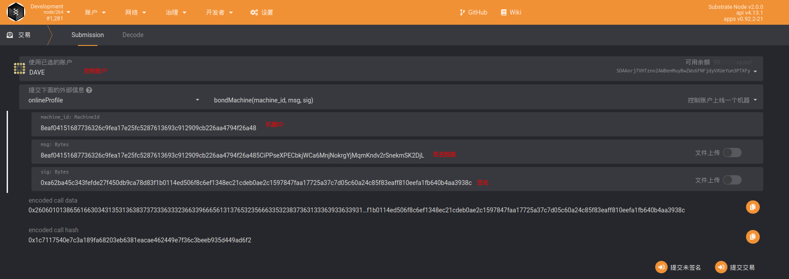
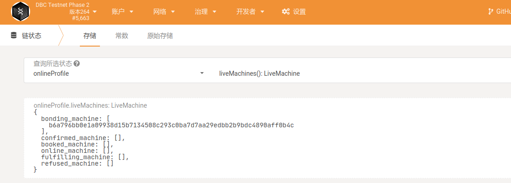
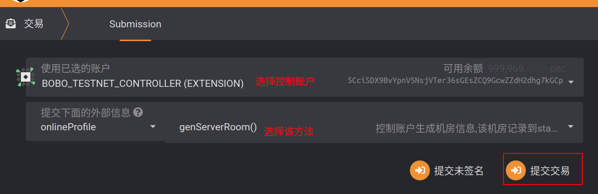
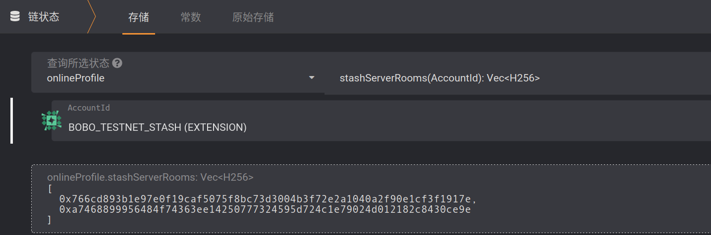
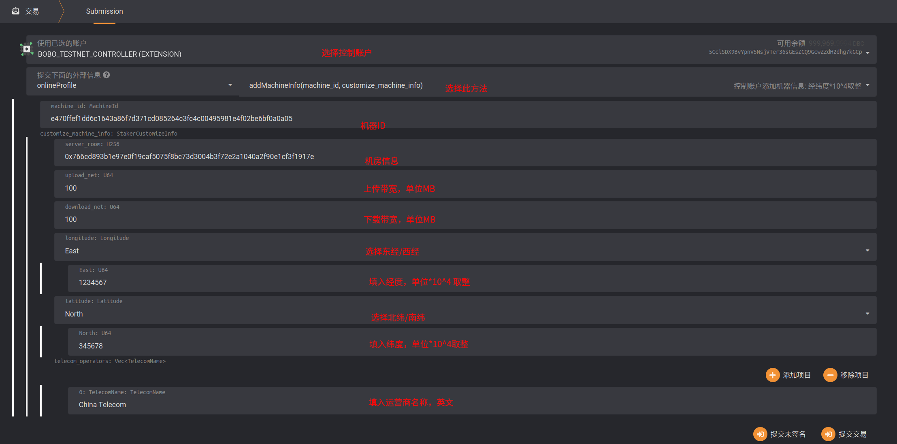
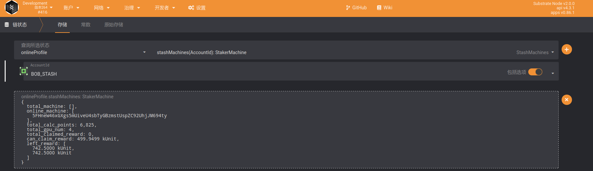
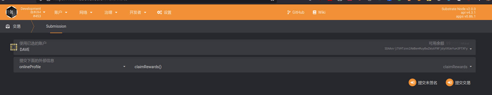

# 机器上链步骤

GPU 机器上线，可以获得在线奖励。本文介绍机器的上线步骤。

## 0. 准备工作

- 上线机器前，需要在机器中安装好 DBC 程序
- 上线机器之前，请确保钱包中有足够的余额。（当前每张 GPU 需要质押 10 万 DBC）。

## 资金账户绑定控制账户

### 1.1 说明

- 为了您的账户资金安全，我们强烈建议使用多签账户作为资金账户，关于多签账户，请转到https://github.com/DeepBrainChain/DBC-DOC/blob/master/DBC_install/%E5%A4%9A%E9%87%8D%E7%AD%BE%E5%90%8D%E8%B4%A6%E6%88%B7.md 了解
- `资金账户`即 `stash` : 绑定机器时将从`资金账户`质押 DBC，分发奖励时将发放到`资金账户`。多个机器绑定到同一个资金账户下，可以获得额外的在线奖励得分。
- `控制账户`即 `controller`: 相当于管理人员，负责机器上链，下链等操作
- `控制账户`要有一些的 DBC，链上操作产生的手续费会从`控制账户`扣除，如上链时，每台机器支付 10 DBC 手续费。

### 1.2 操作

点击`开发者`--`交易`，如下图选择`onlineProfile`模块的`setController`方法，分别选择`资金账户`和`控制账户`，点击右下角"提交交易"，进行绑定。



> 如上图，BOB_STASH 账户(`资金账户`) 将 DAVE 账户设置为了`控制账户`。
>
> `资金账户`: `5HpG9w8EBLe5XCrbczpwq5TSXvedjrBGCwqxK1iQ7qUsSWFc`
>
> `控制账户`: `5DAAnrj7VHTznn2AWBemMuyBwZWs6FNFjdyVXUeYum3PTXFy`

### 1.3 查询资金账户与控制账户是否绑定成功

如下图，当资金账户绑定成功控制账户后，可以通过`开发者`--`链状态`，选择`onlineProfile`模块的`controllerStash`存储，来查询`控制账户`对应的资金账户。下图，查询到了一个控制账户对应的资金账户。



## 2. 机器生成签名消息

> 需要使用机器私钥生成签名消息，发送到链上，以确认资金账户。这一步是为了证明资金账户拥有该机器。

### 2.1 查询`机器ID`和`机器私钥`

需要在安装好 DBC 程序的机器中，查询机器私钥。并用该私钥生成签名消息，发到链上。

```shell
# 机器ID和私钥在dbc安装程序的目录下，如：
# /home/dbc/0.3.x.x/dbc_repo/dat/node.dat
# 其内容为：
node_id=8eaf04151687736326c9fea17e25fc5287613693c912909cb226aa4794f26a48          # 机器ID
node_private_key=398f0c28f98885e046333d4a41c19cee4c37368a9832c6502f6cfd182e2aef89 # 机器私钥
```

### 2.2 使用`机器私钥`生成签名数据

使用我们提供的[脚本](https://github.com/DeepBrainChain/DeepBrainChain-MainChain/blob/master/scripts/test_script/gen_signature.js)生成签名数据。`Signature:`后的数据即为**签名数据**。

```bash
# 自行安装node.js v14
# Clone 仓库，并下载依赖：
git clone https://github.com/DeepBrainChain/DeepBrainChain-MainChain.git && cd DeepBrainChain-MainChain
cd scripts/test_script && npm install

# 生成签名
node gen_signature.js --key 0x398f0c28f98885e046333d4a41c19cee4c37368a9832c6502f6cfd182e2aef89 --msg 8eaf04151687736326c9fea17e25fc5287613693c912909cb226aa4794f26a485CiPPseXPECbkjWCa6MnjNokrgYjMqmKndv2rSnekmSK2DjL

### Message: 8eaf04151687736326c9fea17e25fc5287613693c912909cb226aa4794f26a485CiPPseXPECbkjWCa6MnjNokrgYjMqmKndv2rSnekmSK2DjL
### Signer: 8eaf04151687736326c9fea17e25fc5287613693c912909cb226aa4794f26a48
### Signature: 0x5cc8b4c49b244d7c071b124ef68119d7549dd805ea43f69e3c142fd5909f926041a9cad93b16085d72431df2d1164e7911085423bca16625295583686f2fce8c
```

> `--key` 指定`机器私钥`
>
> **key 前面加上 0x**
>
> `--msg` 指定需要签名的消息，消息内容为 `机器ID+资金账户`；

### 2.3 使用`控制账户`将机器绑定到资金账户

现在，我们需要通过`控制账户`，把步骤 2.2 产生的**_签名数据_**提交到链上。

导航到：`开发者`--`交易`，如下图选择`onlineProfile`模块的`bondMachine`方法。使用`控制账户`，将`机器ID`(`MachineId`)与`控制账户`进行绑定即可。参数填写如下图：



### 2.4 查询机器是否绑定成功

完成上一步后，可以通过`开发者`--`链状态`--`onlineProfile`--`liveMachines`查询系统中的机器。如下图，查询到一台机器已被绑定。接下来需要补充机器信息



## 3. `控制账户`生成机房信息

### 说明

**资金账户第一次绑定机器或者机器在新的机房时**，需要生成一个新的机房 ID。每次生成机房支付手续费`10 DBC`。

如果将要绑定的机器在同一机房，生成一次机房信息即可。如果机器在不同的机房，按情况生成对应个数机房，添加机器信息时，选择对应机房（如果机器在同一机房，则每次添加机器信息，添加相同的机房 ID 即可）。

### 3.1 操作：链上生成新的机房信息



### 3.2 查询资金账户下生成的机房记录

导航到`开发者`--`链状态`，通过`资金账户`，查看**资金账户**下绑定的机房：下图生成了两个机房，查询参数为资金账户。



## 4. `控制账户`添加机器信息

`控制账户`还需要补充机器信息：导航到`开发者`--`交易`--`onlineProfile`--`addMachineInfo`



- 参数说明：
  - server_name: 选择上一步生成的机房 ID
  - upload_net: 上传带宽（**以 20MB 带宽为例，填入 20** ）。
  - download_net: 下载带宽（**以 20MB 带宽为例，填入 20**）。
  - longitude: 经度。选择东经/西经（**以东经 131.1548123 为例，乘以 10000，然后取整得到 1311548。所以网页上选择 East，填入 1311548**,此处误差可以在 30 公里以内，**填错了会扣除质押币**）。
  - latitude: 纬度。选择南纬/北纬（**以北纬 31.143253 为例，乘以 10000，然后取整得到 311432。所以网页上选择 North，填入 311432**,此处误差可以在 30 公里以内，**填错了会扣除质押币**）。
  - 机房信息，可以根据情况，从以下几种中选择：（中国移动：`China Mobile` ， 中国联通：`China Unicom` ， 中国电信： `China Telecom` ， 如为其他网络可以查询英文名进行填写）

## 5. 奖励查询与领取

#### 5.1. 查询奖励

在开发者--链状态中选择：`onlineProfile`模块的`stashMachines`方法，参数填入**`资金账户`**，你将能查到该`资金账户`获得奖励的详细信息。

其中，`can_claim_reward`为能够领取的奖励，`left_reard`为之前每天获得奖励的剩余部分（剩下的 75%，这 75%将在随后的 150 天线性释放）。



#### 5.2. 领取奖励

使用**控制账户**领取即可，奖励将发放到**`资金账户`**。



## 6. 查询账户绑定的机器

- 查看资金账户下上链的机器：导航到`开发者`-->`链状态`-->`存储`-->`onlineProfile`-->`stashMachines`
- 查看控制账户下上链的机器：导航到`开发者`-->`链状态`-->`存储`-->`onlineProfile`-->`controllerMachines`
