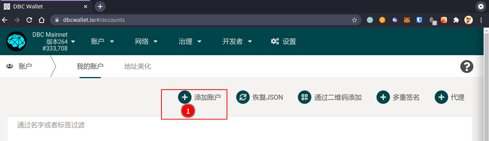

# 如何生成账户

## 方式 1: 通过命令行生成账户

`subkey generate --scheme sr25519`，生成账户，输出内容如下：

```
Secret phrase `final huge obscure action vacuum public banner autumn remove close exotic rotate` is account:
  Secret seed:       0x4b6490134a277f9d4ba36a5671eefa122159dbdecb1fb5f4e937bb8c3f0d2474
  Public key (hex):  0xbae85335116a2f65417d26226ac7d3de188c5160915378ceb4dd7e59a1f0c873
  Public key (SS58): 5GHmn7gTjf7JsXCdieFj7Ypu8gibCXdroU2jG182H2e3zMkf
  Account ID:        0xbae85335116a2f65417d26226ac7d3de188c5160915378ceb4dd7e59a1f0c873
  SS58 Address:      5GHmn7gTjf7JsXCdieFj7Ypu8gibCXdroU2jG182H2e3zMkf
```

> 其中，Secret phrase 为 助记词；Secret seed，即是私钥种子
>
> `subkey`的安装及其他用法，请参考：https://substrate.dev/docs/en/knowledgebase/integrate/subkey

## 方式 2: **通过网页生成账户**

到[网页钱包 https://www.dbcwallet.io/?rpc=wss%3A%2F%2Finfo.dbcwallet.io#/explorer](https://www.dbcwallet.io/?rpc=wss%3A%2F%2Finfo.dbcwallet.io#/explorer)，点击`添加账户`，在弹出框中会提示`助记词`，**点击右侧`助记词`**，可以**_切换到`原始种子`，即为需要保存的私钥，妥善保存！_**




## 使用命令行工具 subkey,将助记词转私钥种子

链上的一些操作，有时候会需要使用私钥来签名。在保存了助记词时，可以通过 subkey 来将助记词转换成私钥。

```
subkey inspect "grief cabin hint replace chalk recall alpha crunch vacant range success rent"
```

生成内容如下：

```
Secret phrase `grief cabin hint replace chalk recall alpha crunch vacant range success rent` is account:
  Secret seed:       0xb4789ce6da4c3eece566ae7848f91822079d7e9b07e4cb77f00beafcb28fb611
  Public key (hex):  0xfabef9d9550ecc3247035be7091ea7d8b384cfdeb1dfae3ff80ba9515cca2570
  Public key (SS58): 5HjUZSGCZgBN86syLVRrW1mAHE6nFZcxK5AFephzoj5xc1FN
  Account ID:        0xfabef9d9550ecc3247035be7091ea7d8b384cfdeb1dfae3ff80ba9515cca2570
  SS58 Address:      5HjUZSGCZgBN86syLVRrW1mAHE6nFZcxK5AFephzoj5xc1FN
```

其中，`Secret seed`即为私钥种子
