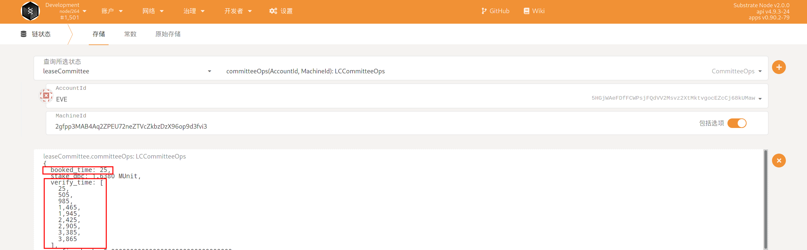

# 委员会处理机器上链请求

## 1. 查看系统分配给自己的订单

+ 导航到 `开发者`-->`链状态`-->`存储`，在其中选择`onlineCommittee`模块的`committeeMachine`存储，点击右侧的`+`号，可以看到委员会的订单情况。如图所示，该委员会有一个系统分配的订单


+ 导航到 `开发者`-->`链状态`-->`存储`，在其中选择`terminatingRental`模块的`committeeMachine`存储，点击右侧的`+`号，可以看到委员会的订单情况。如图所示，该委员会有一个系统分配的订单

  

## 2. 查看系统分配给该委员会进行验证的时间区间

+ 导航到 `开发者`--`链存储`--`存储`，选择`onlineCommittee`的`committeeOps`方法，并输入自己的委员会帐号，与上一步委派的机器 ID，可以查询到类似下面的信息：



+ 短租模式导航到 `开发者`--`链存储`--`存储`，选择`terminatingRental`的`committeeOlineOps`方法，并输入自己的委员会帐号，与上面类似

其中，booked_time 表示派单时间，注意，派单之后的 36~48 小时(也就是区块高度 booked_time + 4320 ~ booked_time + 5760)之间，委员会提交原始信息。

`verify_time` 表示系统分派的，委员会验证机器信息的开始时间。如图，该委员会被分派了 9 次机会来验证机器，每次持续时间为 4 个小时，也就是 480 个块高。此时，委员会可以挑选自己方便的时间，通过前端查询该机器的登录信息，登录到系统中验证机器。

## 3. 查询机器信息（OnlineProfile以这个方式为主，如果遇到返回失败，可以切换到裸金属模式进行查询）

### 3.1 使用 Postman

下载安装 postman，具体下载请去官网根据操作系统安装。

下载 json 文件：http://114.116.21.175:22244/dbc-develop-0.3.7.5.postman_collection.json

导入 json 文件：fiel----import----选择 json 文件导入 import


将客户端 ip 地址以及端口更换为 `121.57.95.175:5679`

### 3.2  使用APIFOX

+ 网页链接：https://46fqx9l1bt.apifox.cn， 如果遇到失效的情况，可以与我们联系。

+ APP 使用： 在API Hub内搜索DeepBrainChain收藏即可

  

### 3.3 查看宿主机详细信息：

```shell
签名工具下载地址：https://github.com/DeepBrainChain/DBC-AIComputingNet/releases/download/0.3.7.3/sign_tool

# 安装依赖 libvirt：
## Ubuntu
sudo apt-get install libvirt
## Arch
yay -S libvirt

# 添加执行权限：
chmod +x sign_tool
 # 然后签名执行：
./sign_tool 钱包地址 钱包私钥
```


在下图中替换：sign、nonce、wallet （注意：同一个机器 sign、nonce 只能使用一次），可以查询到机器信息


查看机器 GPU 信息

### 3.4 创建虚拟机机器


创建过程比较慢，大约在五分钟到十五分钟之间，在 postman 的查看 task 详细信息查看虚拟机登录信息及虚拟机状态，如返回的结果中"status": "creating"表示虚拟机正在创建，此时等待即可


### 3.5 进入创建的虚拟机执行`nvidia-smi -L`查看显卡类型


查询完成后将虚拟机删除，出现 OK 说明删除成功


## 4. 查询机器信息（terminatingRental 模块下以这个方式查询为主，主要涉及裸金属模式，APIfox当中有针对裸金属模式的接口）


+ 验证人使用查询指定裸金属服务器接口，选择正式环境输入设备ID进行查询，返回的结果主要关注```power_satus、deeplink_device_id、deeplink_device_password```,当power显示off时，需要调用开机接口。

+ 这时候获取设备的详细信息，需要验证人使用deeplink连接到我们查询到的这个deeplink ID设备上进行获取。 deeplink下载地址： https://www.deeplink.cloud 。 

+ 如果可以正常登录，则收集相关信息并生成哈希进行提交，如果无法正常获取，则可以拒绝。

  

## 5. 委员会计算获得机器信息的 hash

我们已经提供了脚本来计算需要填写的信息的 Hash：

`https://github.com/DeepBrainChain/DeepBrainChain-MainChain/blob/master/scripts/hash_machine_info.py`

当获取到要求的信息后，修改该脚本，并执行，得到 hash 值。**请保存好所填写的信息，直到该机器上线成功，或者上线失败**

```bash
python3 hash_machine_info.py
```

## 6. 委员会提交机器信息的 Hash

如图，在 36 小时之前提交机器信息的 Hash(提交的时候要注意 0x 一定不能去掉)

注意：如果是在terminatingRental中的机器，则要去terminatingRental 提交submitConfirmHash


## 7. 委员会提交机器的原始信息

**请确保提交机器原始信息时，在派单之后的 36~48 小时之间！**


## 8. 委员会奖励的查询与领取

### 8.1 查询奖励

导航到 开发者--链状态--存储，查询委员会帐号对应的奖励（committee 模块的 committeeStake 方法）。如图，其中`can_claim_reward`为可领取的奖励；`claimed_reward`为已经领取的奖励。


### 8.2 领取奖励

导航到 开发者--交易，选择委员会帐号，选择 `committee` 模块的 `claimReward` 方法，提交交易即可。


## 9. 其他操作

### 9.1 委员会添加质押

可以调用 `committee` --> `committeeAddStake` 方法。当(质押数量-已使用的质押) > 质押数量\*40%时，委员会状态为"可派单的"

### 9.2 委员会减少质押

调用 `committee` --> `committeeReduceStake`方法。注意，最小质押当前为 2 万 DBC，减少后如果小于最小质押，将会无法减少质押。

### 9.3 查询惩罚(TODO)

委员会可以通过 开发者--链状态--选择 committee 模块的 pendingSlash 方法来查询奖励。其中，SlashId 为自增的，可以不包含该值，查询所有还没执行的惩罚。

如下图，可以查看惩罚金额(slash_amount)，原因(slash_reason)，惩罚执行时间(slash_exec_time)，惩罚产生时间(slash_time)等信息。


### 9.4 惩罚申诉(TODO)
