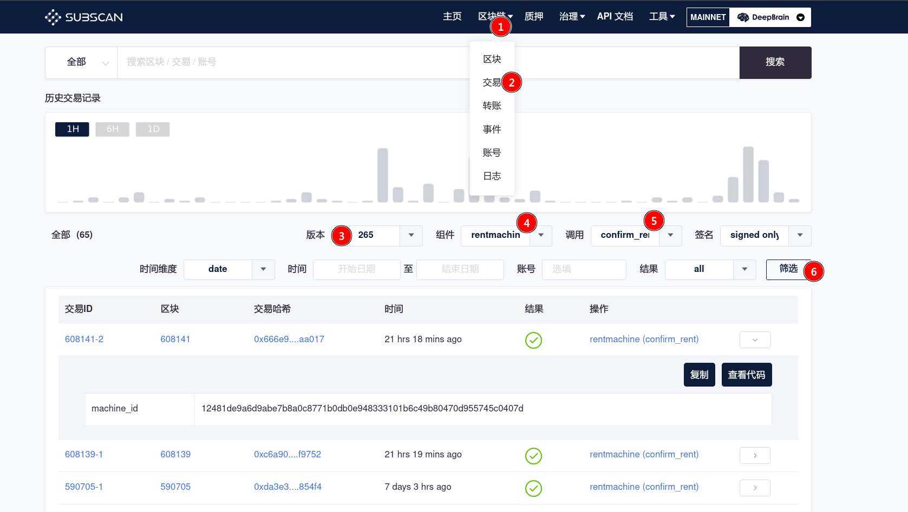
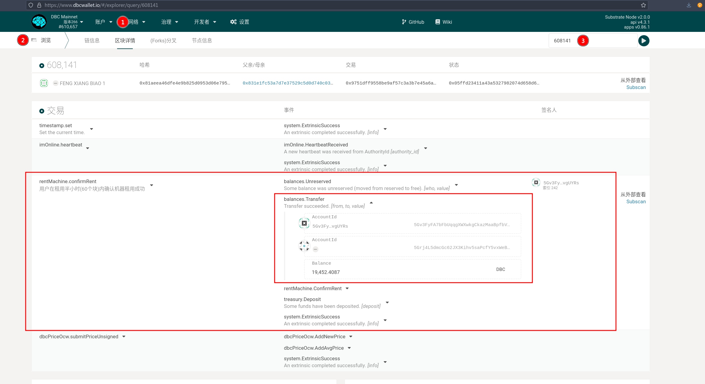

# 查询机器历史订单及租金

思路：

对于一台机器，上链开始后可以被租用。租用后在租期到期之前可以续租。因此，定金支付有两个时刻：1. 被租用后，调用租用成功方法的时候；2. 在租用过程中，调用续租的方法时。

这两个方法调用分别是： `rentMachine-confirmRent`，`rentMachine-reletMachine`。

例如，可以到 subscan，查到所有的确认租用的交易。

如图，可以查询到机器`12481de9a6d9abe7b8a0c8771b0db0e948333101b6c49b80470d955745c0407d` 在 608141 被确认租用。

通过查询 608141 的交易：

可以查询到 5Gv3Fy…vgUYRs 用户调用了`确认租用`，执行该调用后，质押的金额被转移给了机器的 stash 账户。
