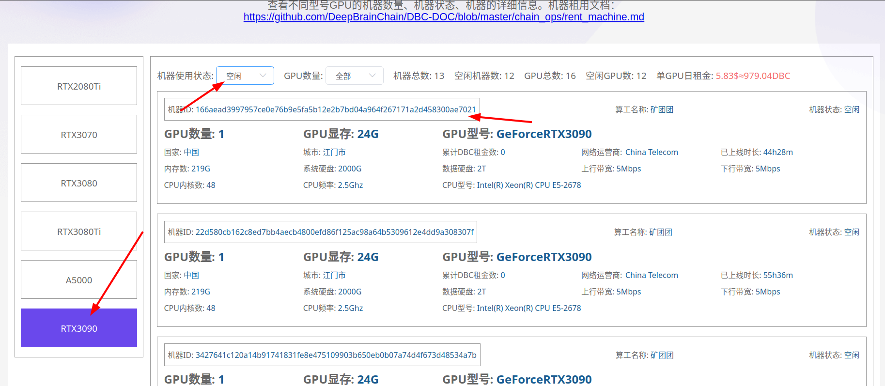

# 链上机器租用

## 步骤一: 确定要租用的机器

- 打开[主网钱包](https://www.dbcwallet.io/?rpc=wss://info.dbcwallet.io)

- 创建钱包：账户-->添加账户 （助记词一定要保存好，丢失了助记词，账户就无法找回，币就丢失掉了）

- 到 [银河竞赛机器列表](https://galaxyrace.deepbrainchain.org/table) 找到对应类型的空闲机器

  

## 步骤二：租用链上机器

- 导航到 `开发者`---`交易`---`rentMachine` ----`rentMachine(machine_id, rent_gpu_num, duration)`

- machine_id 输入要租用的机器 id，输入框里面的`0x`要先删除掉

- rent_gpu_num 输入本次要租用的 GPU 数量（不超过该机器的空闲 GPU 数；当前按 GPU 数计费，支持一机多租）

- duration 输入需要租用的时间(单位：1 BlockNumber = 6 seconds, 最低租用半小时起，租用时间也是300个块高的倍数，即300 * N )

- 输入完成后点击提交交易。提交成功后会生成一个**租用订单号 `rent_id`**（可在交易事件 `rentMachine.Rent` 中查看，或在 `开发者`-`链状态`-`rentMachine`-`userOrder(你的账户)` 中查询）。后续的确认、续租都使用这个 `rent_id`。

- 请在三十分钟内确认机器是否可用。（如果 30 分钟内不确认租用，支付的`dbc`会退回，但是交易手续费 10 `dbc`是无法退回的）

- 创建虚拟机等相关操作请[参考](https://github.com/DeepBrainChain/DBC-DOC/blob/master/creat_macine/create_macine.md)

## 步骤三：确认可用并租赁

::: warning
确认之前必须要确认虚拟机能够正常启动。确认租用成功过后，表示机器租用成功，DBC 租金无法退回
:::

- 导航到`开发者`----`交易`----`rentMachine`----`confirmRent(rent_id)`

- 输入步骤二得到的租用订单号 `rent_id` 并提交交易即可

## 步骤四：机器续租

::: warning
机器到期会自动停止虚拟机，确保在租用到期之前续租成功
:::

- 导航到`开发者`----`交易`----`rentMachine`----`reletMachine(rent_id, relet_duration)`

- 输入租用订单号 `rent_id` 以及续租时长（`relet_duration`，单位为块高，需为 300 的倍数；例如续租 1 天填 14400），提交交易
