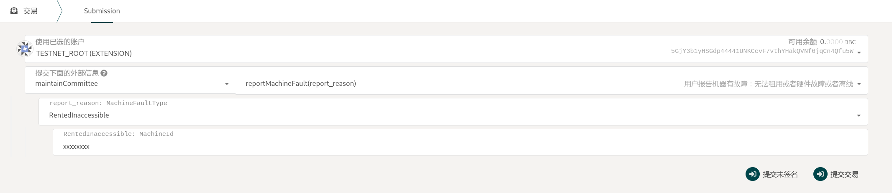
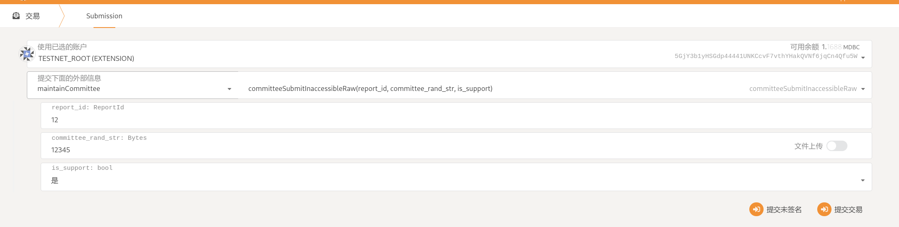

# 租用人举报机器故障

::: warning
文档正在完善中
:::

可以举报的四种机器故障按处理方式的不同分为两类，

1. 机器被租用时**无法访问故障(`RentedInaccessible(MachineId)`)**,

2. 其他类型故障，包括

   机器被租用，但是有**硬件故障(`RentedHardwareMalfunction(ReportHash, BoxPubkey)`)**；

   机器被租用，但是**硬件造假(`RentedHardwareCounterfeit(ReportHash, BoxPubkey)`)**；

   机器是在线状态，但是**无法租用(`OnlineRentFailed(ReportHash, BoxPubkey)`)**

下面对两种举报的过程做简要说明：

::: tip
在本文档中，验证人即验证委员会，因此验证人/委员会这样的描述可能会被混用。
:::

## 1. 机器被租用时无法访问

该类型被设计为验证人可以快速响应该报告，验证人可以用程序监控链上的这种报告并自动抢单，自动判断报告是否有效，并自动提交处理结果。因此，这种报告的故障处理速度最快。

报告信息被明文提交到链上，用以适应这种处理方式。

### 1.1. [角色：报告人] 向链上举报：

执行`report_machine_fault`，报告人需选择`故障类型`为 `RentedInaccessible`，并提供机器 ID



支付费用： 10 DBC

存储变更：

```json
LiveReport.bookable_report,

ReporterReport.processing_report

ReportInfo: {
    reporter,
    report_time,
    reporter_stake,
    machine_fault_type,
    report_status: Reported
}
```

::: tip 注意
当且仅当在有人抢单之前，报告人可以取消报告
:::

### 1.2. [角色：验证人] 进行抢单

执行`committee_book_report`

在第一个验证人抢单之后，5 分钟内将会开始提交验证结果，10 分钟时结束验证。

支付： 10 DBC

存储变更：

```
reporter_info {
    first_book_time: now (when is first_book),
    report_info.report_status: WaitingBook (when booked < 3) | Verifying (when booked == 3),
   confirm_start: now + 10 (when is first_book),
}

committee_ops {
    booked_time: now,
    order_satus: Verifying,
}

live_report {
    bookable_report.remove(report_id) (when booked_committee == 3),
    verifying_report.add(report_id) (when booked_committee == 3),
}

committee_order {
    booked_report.add(report_id)
}
```

### 1.3. [角色：(其他)验证人] 进行抢单

- 执行`committee_book_report`

- 需要在第一个验证人抢单之后的 5 分钟(10 个块)内进行抢单

- 最多有 3 个验证人进行抢单

### 1.4. [角色：(已抢单)验证人] 提交`确认信息`的 Hash:

执行 `committee_submit_verify_hash`


::: tip Hash 生成方式
hash("report_id" + "committee_rand_str" + "is_support");
生成 hash 时请修改脚本： `https://github.com/DeepBrainChain/DeepBrainChain-MainChain/scripts/hash_machine_inaccessible.py`
:::

### 1.5. [角色： (已抢单)验证人]提交`确认信息`

执行 `committee_submit_inaccessible_raw`

**TODO** 修改该函数名称



::: tip
等待所有已成功抢单的委员会提交原始信息或者到第一个验证人抢单之后 10 分钟时，将会统计委员会的验证结果，并进行处理
:::

存储修改

```
CommitteeOps {
    confirm_time: now,
    confirm_result: is_support,
}

ReportInfo {
    confirmed_committee.add(committee),
    support_committee.add(committee) (is_support == true),
    against_committee.add(committee) (is_support == false),
}
```

### 1.6. 系统判定结果

TODO
