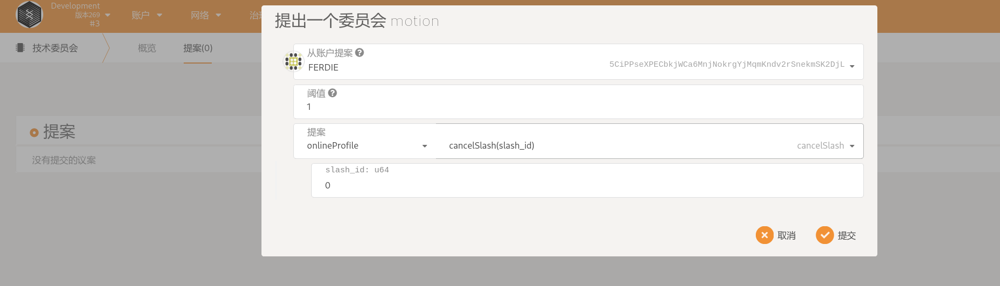

# 租用人举报机器故障

::: warning
文档正在完善中
:::

可以举报的四种机器故障按处理方式的不同分为两类:

1. 机器被租用后**无法访问故障(`RentedInaccessible(MachineId)`)**,

2. 其他类型故障，包括

   - 机器被租用，但是有**硬件故障(`RentedHardwareMalfunction(ReportHash, BoxPubkey)`)**；

   - 机器被租用，但是**硬件造假(`RentedHardwareCounterfeit(ReportHash, BoxPubkey)`)**；

   - 机器是在线状态，但是**无法租用(`OnlineRentFailed(ReportHash, BoxPubkey)`)**

下面对两种举报的过程做简要说明：

::: tip
在本文档中，验证人即验证委员会，因此验证人/委员会这样的描述可能会被混用。

当且仅当在有人抢单之前，报告人可以取消报告。
:::

## 1. 机器被租用后无法访问

该类型被设计为验证人可以快速响应该报告，验证人可以用程序监控链上的这种报告并自动抢单，自动判断报告是否有效，并自动提交处理结果。因此，这种报告的故障处理速度最快。报告信息被明文提交到链上，用以适应这种处理方式。

### 1.1. [角色：报告人] 向链上举报

执行`report_machine_fault`，报告人需选择`故障类型`为 `RentedInaccessible`，并提供机器 ID

支付费用： 10 DBC (此种类型举报的额外费用)

质押 1000 DBC


### 1.2. [角色：验证人] 进行抢单

执行`committee_book_report`

在第一个验证人抢单之后，5 分钟内将会开始提交验证结果，10 分钟时结束验证。

委员会可以监控 maintainCommittee.bookableReport 来查看是否有可抢单的报告

可以查询 maintainCommittee.reportInfo 来查询报告的具体信息(错误类型，举报时间等)

支付： 10 DBC

质押： 0 DBC (这种类型的举报不需要委员会质押)

### 1.3. [角色：(其他)验证人] 进行抢单

- 执行`committee_book_report`

- 需要在第一个验证人抢单之后的 5 分钟(10 个块)内进行抢单

- 最多有 3 个验证人进行抢单

- 消耗 10 DBC 质押 1000DBC

### 1.4. [角色：(已抢单)验证人] 提交`确认信息`的 Hash:

执行 `committee_submit_verify_hash`


::: tip Hash 生成方式
hash("report_id" + "committee_rand_str" + "is_support");
生成 hash 时请修改脚本： `https://github.com/DeepBrainChain/DeepBrainChain-MainChain/scripts/hash_machine_inaccessible.py`
:::

### 1.5. [角色： (已抢单)验证人]提交`确认信息`

- 只有所有抢单的委员会都提交了 Hash 或者 距离首次抢单 5 分钟(10 个块)才允许验证人提交原始信息

执行 `committee_submit_inaccessible_raw`


::: tip
等待所有已成功抢单的委员会提交原始信息或者到第一个验证人抢单之后 10 分钟时，将会统计委员会的验证结果，并进行处理
:::

### 1.6. 系统判定结果

TODO

## 2. 其他故障

如前所述，其他故障包括：

机器被租用，但是有**硬件故障(`RentedHardwareMalfunction(ReportHash, BoxPubkey)`)**；

机器被租用，但是**硬件造假(`RentedHardwareCounterfeit(ReportHash, BoxPubkey)`)**；

机器是在线状态，但是**无法租用(`OnlineRentFailed(ReportHash, BoxPubkey)`)**

### 2.1. [角色： 报告人] 向链上举报

执行 `report_machine_fault`，报告人需选择`故障类型`为上述三种错误之一。这里以`无法租用`为例:

生成报告 Hash: 根据报告内容，修改脚本中的`machine_id`和`rand_str`,然后执行下面命令生成报告 Hash

```shell
❯ python hash_machine_fault.py
ReporterHash: 0x00e8af0f2ad79a07985e42fa5a045a55
CommitteeHash: 0xc45a1e9471d6e0e539febe382b009070
```

同时，还需要提供自己的 BoxPubkey，用于委员会收到加密信息后的解密:

::: tip
如果是多签账户，或者不知道私钥，可以重新生成一个 SS58 账户，并使用该 SS58 的私钥生成 BoxPubkey。后续的操作使用该密钥对即可。
:::

```
❯ node gen_boxpubkey.js --key 0xeb2a67b0d6d3e457076c3d4f9633e7400921fa49887324131b4a9520e5971c4c
0x20859b983f7f4f3aaf0a41915d0e61b27f90f9b0ffb9310eeee201a997c8b910
```

然后调用举报函数:


### 2.2. [角色：验证人] 进行抢单

执行`committee_book_report`

在第一个验证人抢单之后，5 分钟内将会开始提交验证结果，10 分钟时结束验证。

委员会可以监控 maintainCommittee.bookableReport 来查看是否有可抢单的报告

可以查询 maintainCommittee.reportInfo 来查询报告的具体信息(错误类型，举报时间等)

支付： 10 DBC

质押： 1000 DBC

### 2.3 [角色：报告人]提交加密信息

当验证人进行抢单后，报告人需要在 30min (60 个块)中内，提交加密信息给抢单的委员会，超时未提供加密信息，将导致举报失败(举报人将因此被惩罚)。

```shell
# 生成加密信息
node seal_msg.js --sender_privkey 0x0cdc17e4cd84743c66bae7761ad354d423c93ac1e398630575d91371d6f713ce --receiver_box_pubkey 0x20da91ba45f5ed8fddd40d5439f817c9f00750694ed5c70d17e421caf15f437b --msg "abcdefg bcdefa"
```

其中，
`--sender_privkey`为举报人的私钥；
`--receiver_box_pubkey`为委员会（接收人）的 box_pubkey，可以通过下面方式查询：
`--msg`为要加密的错误信息，比如为`machine_id 有内存故障`，注意: **`--msg` 为 要举报的`machine_id` + 报告人随机字符串 + 错误信息**，如`8eaf04151687736326c9fea17e25fc5287613693c912909cb226aa4794f26a48[abcdef]补充信息，可留空`

### 2.4 [角色：委员会] 收到加密信息后解密

当报告人提供了加密的信息后，委员会需要解密来查询报告人提交的信息

```shell
node open_msg.js --sender_box_pubkey 0xe30cac79ec5fe7c9811ed9f1a18ca3806b22798e24b7d9f9424b1a27bde3e866 --receiver_privkey 0x171baa0f7baa4fa7e2dd94b8f9efc0b95034a4ad5f3aba5b6b923e38130c3f0d --sealed_msg 0x01405deeef2a8b0f4a09380d14431dd10fde1ad62b3c27b3fbea4701311d
```

其中，
`--sender_box_pubkey` 为举报人的 box_pubkey，可通过`maintainCommittee.reportInfo.machine_fault_type`中的信息查询；

`--receiver_privkey`为委员会自己的 box_pubkey 对应的私钥
`--sealed_msg`为委员会收到的加密的信息

解密完成后，委员会需要根据实际情况判断，机器是否有问题。并提交到链上

查询委员会 BoxPubkey:


### 2.5 [角色：委员会]判断机器故障信息，并提交到链上


其中，`extra_err_info`为委员会判断的，可能不同于报告人认为的错误原因。该字段也可留空

## 3. 结果执行与申述

### 3.1 举报结束后的奖励与惩罚

当举报完成，根据委员会提交的结果将会进行惩罚与奖励。简单的说，

- 对于验证人来说，

  - 未完成所有任务的委员会将被惩罚，如预订了报告/提交了验证 Hash，却没有最终提交确认信息

  - 验证结果与多数委员会不同的情况，如 2 个委员会反对举报，1 个委员会支持举报，则支持的委员会会被惩罚，其余 2 个委员会会被奖励

  - 当成功完成验证机器故障任务，并与其余多数委员会观点相同（都认为机器有故障/无故障）时，会被奖励

- 对于举报人来说

  - 当举报人举报需要提交加密信息的故障类型时，如没有在委员会抢单半小时内提交加密信息，举报将会失败，会被惩罚

  - 当举报人的举报被大多数委员会所反对时，会被惩罚

  - 当举报被大多数委员会支持时，会被奖励

- 对 machine_stash 来说，

  当举报成功时，会被惩罚

### 3.2 奖励与惩罚发生后的申述

当举报发生后，链上将记录该惩罚，并在惩罚发生后的**两天后(2880\*2 个块)执行**，允许被惩罚的委员会/报告人进行申述。申述将会由技术委员会来处理。技术委员会判定申述有效后，将会取消该惩罚。

其中，当机器因举报成功被下架后，需要检查、处理故障后，尽快上架以减少惩罚。当机器被错误惩罚后，也许要上架后，进行申述（同样有 2 天时间），请求技术委员会判定。

未成功完成任务的委员会不允许申述

申述需要质押一定的币，当申述失败后，质押的币将会被扣除。

## 4. 技术委员会取消惩罚

当被惩罚人，质押一定的 DBC，提出技术委员会申述后，技术委员会可以在惩罚执行前取消惩罚。

只要到对应模块中调用取消惩罚(`cancel_slash`)即可，其中阈值设置为 1（1/5），`slash_id`为申述的需要取消的惩罚。如，

### 4.1 [角色：技术委员会]根据申述取消惩罚

- 取消报告人的惩罚，需要调用`maintainCommittee--cancelReporterSlash`

- 取消 stash(因机器下线后再上线导致)的惩罚，需要调用`onlineProfile--cancelSlash`

- 取消上线委员会的惩罚（因没有分配的工作，或者与处理该订单的其他大多数委员会的观点不一致)，需要调用`onlineCommittee-cancelSlash`


