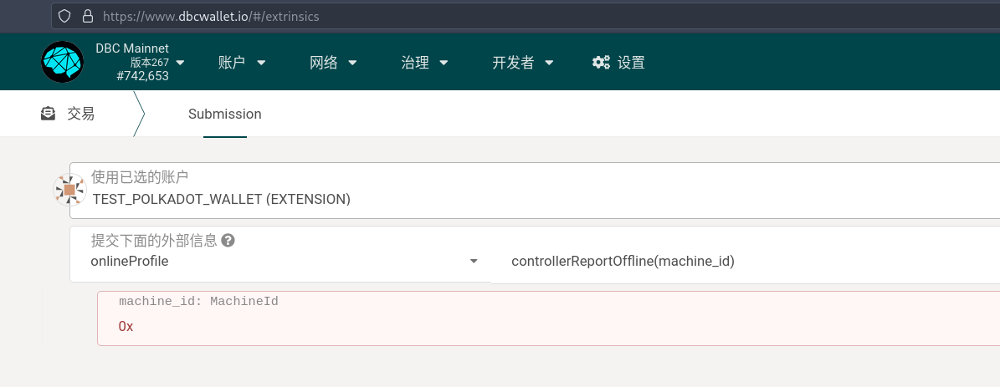
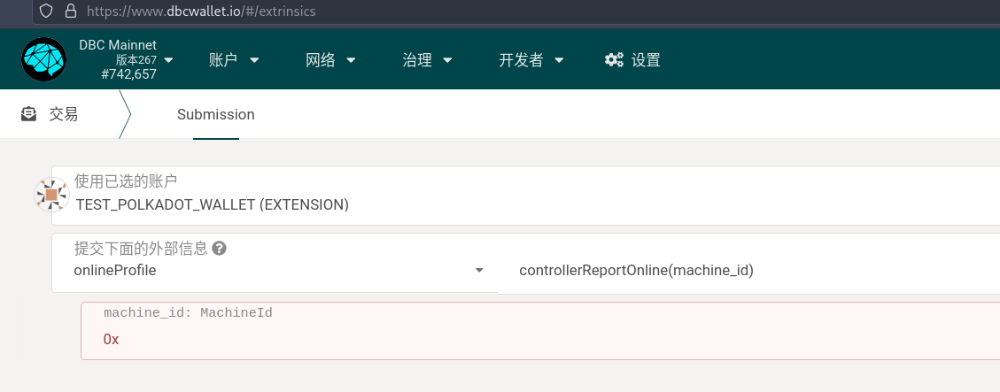

# 机器下链步骤

::: warning 注意！
⚠️ 不正确的下线可能会导致质押被惩罚！
:::

机器下线分为 `因故障下线`和`因需要改变配置而下线`两种情况。

- 因故障下线

1. 若机器**出现故障**，为了避免被租用人举报而产生惩罚，需要使用机器控制账户向链上报告机器下线以处理故障。故障处理完成后，可以再向链上报告上线。

2. 若机器需要**永久下线**，可以由控制账户向链上报告机器下线。

- 因需要改变配置而下线

当机器配置变更，为了使线上线下配置一致，避免被举报而产生惩罚，机器需要主动报告来请求变更配置。这时候，机器将会被随机分派给验证人，来提交新的机器配置到链上。

## 机器因故障下线

根据机器的状态（被租用|空闲），下线会产生不同的惩罚。惩罚额度参考[算工主动发送下线通知时](https://deepbrainchain.github.io/DBC-Wiki/onchain-guide/machine-slash-model.html#_1-算工主动发送下线通知时)

下线时长及空闲时长（距上一次租用结束）对惩罚额度有影响。**空闲超过 10 天，下线后不会产生惩罚。机器的质押，可以在距离第一次上线 365 天之后申请退回**

下线后，可以再上线/或者永久下线。如果超过 10 天没有上线，将会按下线 10 天的情况进行处理。

### 下线链上操作

到开发者--交易，选择`控制账户`，执行`onlineProfile`模块的`controllerReportOffline`方法。如下图：

### 下线后上线链上操作

到开发者--交易，选择`控制账户`，执行`onlineProfile`模块的`controllerReportOnline`方法。如下图：

## 机器因需要改变配置而下线

TODO
