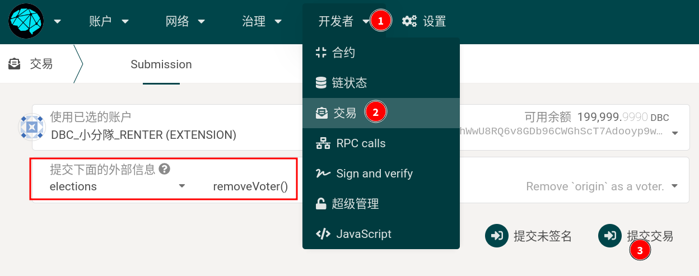

# 质押/解绑常见问题

## 1. 验证人/投票人 如何增加/减少质押?

> 或： 验证人/投票人 如何解除/增加绑定

网页浏览器上，导航到：

1. `网络--质押--账户操作`，找到想要操作的帐号。

2. 在该帐号的右侧，点击`⁝` 符号，在菜单里根据需要选择：

   1. "绑定更多资金"：用来增加质押

   2. 解除绑定资金：用来减少质押

 

3. 如点击解除绑定资金后，出现解除绑定资金的界面，在里面选择想要解除绑定的数量，点击解除绑定即可。

 

::: warning 注意
解除质押，需要等待 14 天。14 天过后，需要到图 1 中，选择提取绑定资金。或者在帐号页面执行提取绑定资金
:::

## 2. "目前正在进行新的验证人候选人的选举。因为这样的 staking 操作是不允许的。"

在 `网络--质押--账户操作`页面，有时候会看到这样的信息

:::warning
目前正在进行新的验证人候选人的选举。因为这样的 staking 操作是不允许的。
:::

这是因为每天有半个小时，是选举下一天的出块节点的。在选举过程中，无法进行质押相关的操作。

在这段时间(大约为 10:00~10:30AM 之间)之外操作即可。

## 3. 如何退出验证节点/验证人

到`网络--质押--账户操作`，找到想要操作的帐号，点击帐号右侧的“停止”按钮即可。

## 4. 如何解议会绑里的质押

当在 `治理--议会--投票`页面，给议会候选人投票之后，DBC 将会质押到该模块中，需要手动执行取消投票的操作，才能解绑。

 

## 5. 如何解绑民主投票里的质押

### 5.1 到 subscan 查询自己民主投票记录

[subscan](https://dbc.subscan.io)

- 5.2 在`开发者--交易`页面，选择`democracy`--`removeVote`，并执行。

- 5.3 然后，在`开发者--交易` 页面，选择`democracy`--`unlock`，并执行。

## 6. 如何退出委员会候选人

