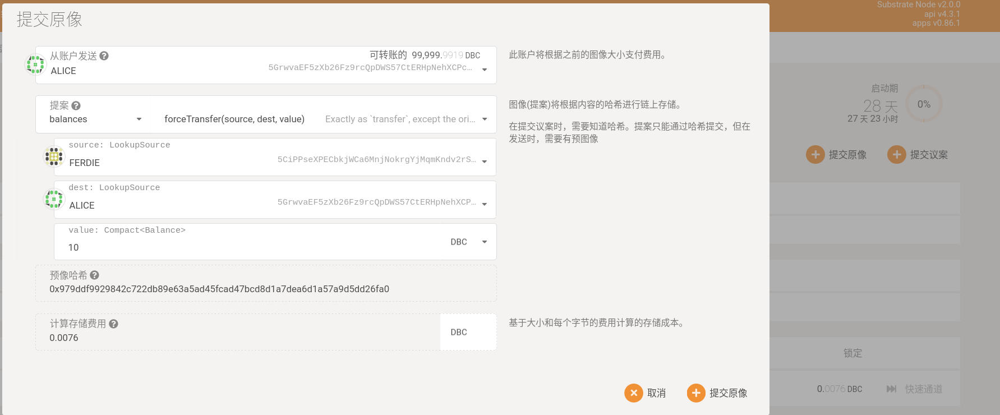
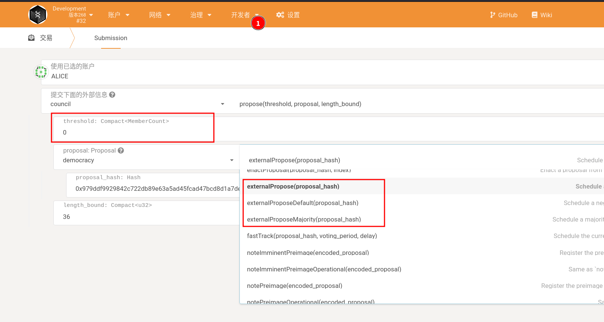
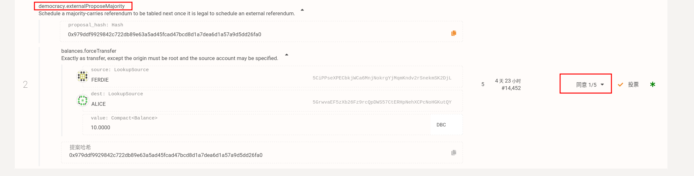
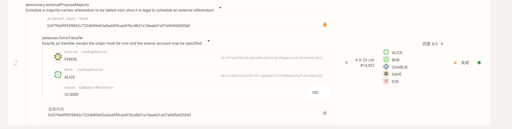
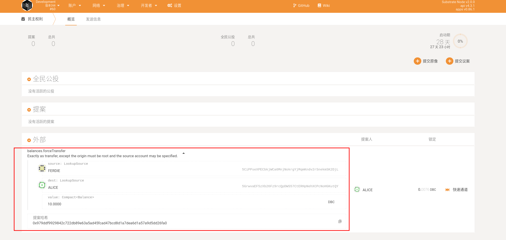

# 议员提案流程

## 1. 提交原像

本文以强制转账为例，进行说明。其他调用类似。

打开网页钱包，导航到"治理"--"民主权利"--"提交原像"，在如下图所示的弹出页面种，选择强制转账的函数调用。

如图表示，强制从 Ferdie 转账 10 个 token 到 Alice。

注意，**需要复制下预像 Hash**: `0x979ddf9929842c722db89e63a5ad45fcad47bcd8d1a7dea6d1a57a9d5dd26fa0`

## 2. 提交外部议案

导航到"开发者"--"交易", 使用议会成员 Alice (普通帐号没有权限调用 council_propose)。

阈值 threshold 表示通过下面的调用需要委员会同意的个数，该阈值需要根据 democracy 的方法来决定。最后再填写。

选择 democracy 下的 外部议案（externalPropose），外部默认通过的议案（externalProposeDefault）或者 externalProposeMajority 三者之一，

它们区别在于需要议会同意的个数及随后进行公投的通过条件不同:

1. 议会同意的个数不同。externalPropose 需要>=1/2 同意；externalProposeDefault 需要 1/1 同意；externalProposeMajority 需要>=3/4 委员会同意。

2. 这三个不同的委员会通过条件，对应着全民公投的通过条件的难易。

externalPropose 需要 Super Majority approve 的全民公投

externalProposeDefault 需要 Super Majority Against 的全民公投

externalProposeMajority 需要 Simple Majority 的全民公投

全民公投通过的通过条件计算公式具体参考：[https://deepbrainchain.github.io/DBC-Wiki/dbc-democracy/voting-referenda.html#\_3-%E7%BB%93%E6%9E%9C%E5%88%A4%E5%AE%9A%E6%96%B9%E5%BC%8F](https://deepbrainchain.github.io/DBC-Wiki/dbc-democracy/voting-referenda.html#_3-%E7%BB%93%E6%9E%9C%E5%88%A4%E5%AE%9A%E6%96%B9%E5%BC%8F)

## 3. 委员会投票

在上图中，我们选择 externalProposeMajority 这个方法，它需要>=3/4 的委员会同意。在本次测试中，议会共有 6 名成员，因此，6\*3/4 =4.5，我们至少需要 5 名委员会通过才能满足条件。因此我们阈值设置为 5.

提交后，我们可以在"治理"--"议会"--"Motions"下看到我们提交的议案。

现在可以提交给委员会议案说明并号召委员会对该议案进行投票。

投票完成后，我们点击右边的”关闭“

## 4.等待进入公投

完成上述步骤后，我们可以在”治理“--"民主权利"这里找到我们的议案，正在等待进入全民公投。

### 进入公投的时间

当既有提案，又有外部提案时，外部提案先进入全民公投
