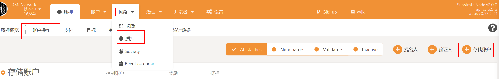
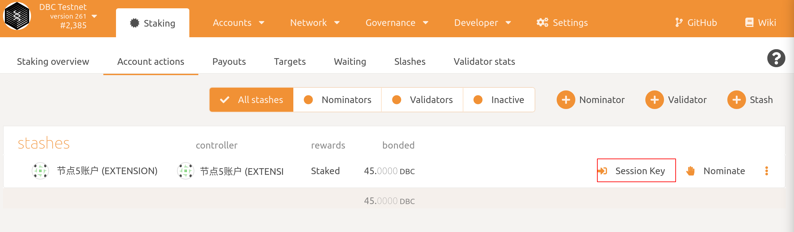
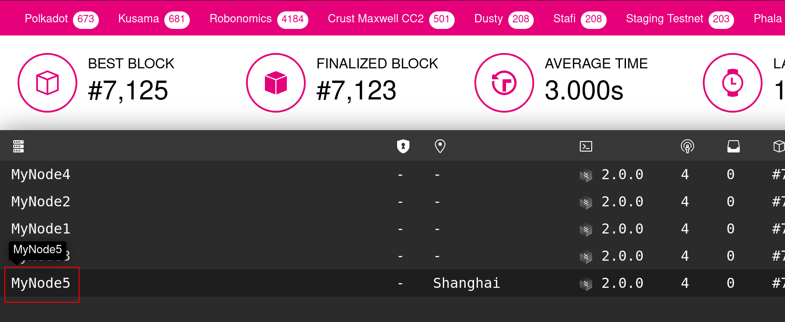
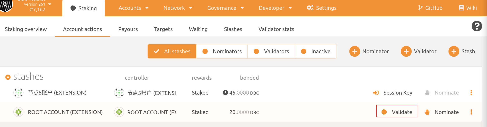
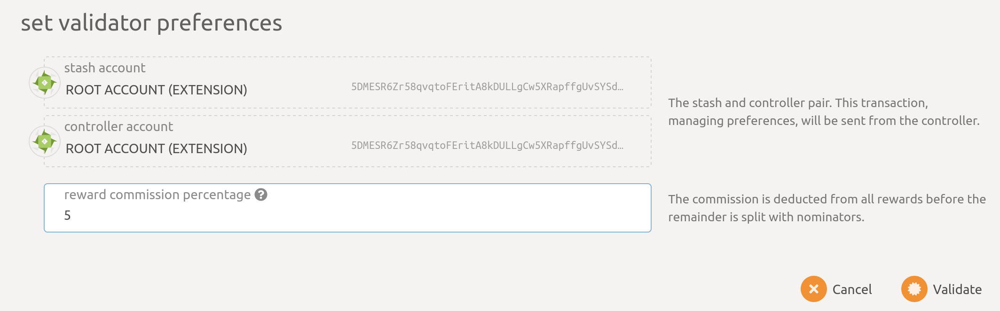
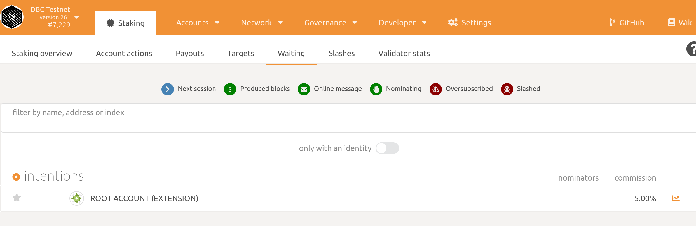
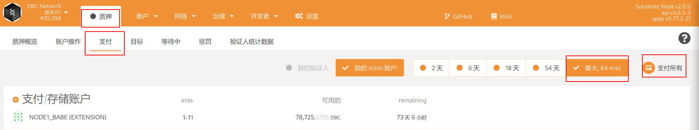

# 成为DBC AI 公链验证节点

**注意： 1. 在您开始执行之前，一定要使用一个新的db_data来启动节点，以防出现数据同步错误，导致您无法出块并遭受惩罚。 2. 如果您参与过竞选或者启动了新的节点，请及时生成新的sessionkey 并在质押--账户部分进行替换**

## 0. 机器配置

- 内存：8G
- CPU：2 核
- 硬盘：300G+ (推荐500G）
- 系统： Ubuntu20.04及以上版本（推荐22.04）

## 1. 生成资金账户（已有资金账户可以略过）

参考： [如何生成账户](generate-new-account.md)

## 2. 获取 dbc-chain 二进制

### 方式 1: 使用预编译版本

```bash
sudo mkdir dbc-chain-mainnet && cd dbc-chain-mainnet

wget https://github.com/DeepBrainChain/DeepBrainChain-MainChain/releases/download/v4.0/dbc-chain-4.tar.gz -O dbc_chain_linux_x64.tar.gz

tar xf dbc_chain_linux_x64.tar.gz 

```

### 方式 2：从源码进行编译

```bash
# 安装依赖
curl https://getsubstrate.io -sSf | bash -s -- --fast
source ~/.cargo/env

# 编译dbc-chain
git clone https://github.com/DeepBrainChain/DeepBrainChain-MainChain.git
cd DeepBrainChain-MainChain
cargo build --release
```

## 3. 运行同步节点

```bash
nohup ./dbc-chain --base-path ./db_data --chain=mainnet --port 30333 --rpc-port 9983 --pruning=archive --name dbc-chain --rpc-cors=all --rpc-methods=unsafe --rpc-external  1>dbc_node.log 2>&1 &
```

- 如果你是从源码进行编译，可执行文件路径为：`./target/release/dbc-chain`

- 同步完成后，`Control + C`关掉程序。你可以根据`target`与`best`的比较来判断是否同步已经完成。当 target 与 best 相差不大（如 100 以内）时，可以认为已经完成同步。


- **参数说明：**
  - `--base-path`：指定该区块链存储数据的目录。如果不指定，将使用默认路径。如果目录不存在，将会为你自动创建。如果该目录已经有了区块链数据，将会报错，这时应该选择不同的目录或清除该目录内容
  - `--pruning=archive`：以归档的方式启动区块链

## 4. 以验证人的方式运行节点

```shell
#启动节点
nohup ./dbc-chain --base-path ./db_data --chain=mainnet --port 30333 --rpc-port 9983 --validator --pruning=archive --name YourNodeName --rpc-cors=all --rpc-methods=unsafe --rpc-external  1>dbc_node.log 2>&1 &

#如果遇到启动报错
./dbc-chain: /lib/x86_64-linux-gnu/libstdc++.so.6: version `GLIBCXX_3.4.30' not found (required by ./dbc-chain)
./dbc-chain: /lib/x86_64-linux-gnu/libstdc++.so.6: version `GLIBCXX_3.4.29' not found (required by ./dbc-chain)
./dbc-chain: /lib/x86_64-linux-gnu/libc.so.6: version `GLIBC_2.32' not found (required by ./dbc-chain)
./dbc-chain: /lib/x86_64-linux-gnu/libc.so.6: version `GLIBC_2.34' not found (required by ./dbc-chain)
./dbc-chain: /lib/x86_64-linux-gnu/libc.so.6: version `GLIBC_2.33' not found (required by ./dbc-chain)

#解决方案：
#1.中国地区的设备：
echo "deb http://mirrors.aliyun.com/ubuntu/ jammy main" >> /etc/apt/sources.list
sudo apt update
sudo apt install libc6 libstdc++6 -y
#2. 非中国地区设备：
echo "deb http://archive.ubuntu.com/ubuntu/ jammy main" >> /etc/apt/sources.list
sudo apt update
sudo apt install libc6 libstdc++6 -y
- 如果你是从源码进行编译，可执行文件路径为：`./target/release/dbc-chain`

- 注意，这里 **`--name YourNodeName` 是设置你的节点名称**，你可以为你的节点起一个独一无二容易辨认的名称，别人将能在网络上看到它。
 
```

## 5. 生成`rotateKey`

在运行验证人节点命令的机器上运行下面命令

```bash
curl -H "Content-Type: application/json" -d '{"id":1, "jsonrpc":"2.0", "method": "author_rotateKeys", "params":[]}' http://localhost:9983
```

## 6. 设置绑定（bond）金额

- 打开[https://www.dbcwallet.io/?rpc=wss://info1.dbcwallet.io#/accounts](https://www.dbcwallet.io/?rpc=wss://info1.dbcwallet.io#/accounts) 你将能看到你的余额：

- 导航到`网络` >`质押` > `账户操作` > `存储账户`，



- 设置 bond 的金额（确保除了 bond 的数额，您的账户中还有余额以用来发送交易）：


**说明：**

- `Stash account`：你的资金账户，这里我们 bond 45 DBC，确保账户中余额至少有这么多

- `controller account`：这个账户也应该有少量的 DBC 来发送开始和停止验证人的交易

- `value bonded`：你想要 bond/stake 多少 DBC, 请注意，你不需要 bond 账户中所有的余额，另外你随后可以增加 bond 的数额。

- `payment destination`：验证人获得的奖励将会被发给这个账户。这个账户可以设置成任何账户。其中，

- `Stash account(increase the amount at stake)`: 收益发放到 stash 账户，并质押

- `Stash account(do not increase the amount at stake)`：收益发放到 stash 账户，不进行质押

## 7. 设置`rotateKey`

- 在执行了 bond 之后，您将能够在 Polkadot 上看到`Session Key`的按钮：



- 点击它，并将步骤 5 生成的`rotateKeys`填入。


- 现在，你可以到 [Telemetry](https://telemetry.polkadot.io/#list/0x03aa6b475a03f8baf7f83e448513b00eaab03aefa4ed64bd1d31160dce028add)看到你的节点了！



## 8. 设置参加验证人选举

- 完成了上述步骤后，你将能看到`Validate`的按钮。点击`Validate` 按钮，



- 这时你将需要设置验证人偏好：



- 在 `reward commission percentage`栏目中，你将需要输入你作为验证人的收益偏好。然后点击右下角`Validate`，并发送交易。在`Waiting`界面，你将能看到你的账户正在等待下个`Era`，来参加选举成为验证人节点。



## 9. 领取节点奖励

在浏览器插件 polkadot 中登陆你的 stash 账户，在 `质押 > 支付 > 最大84 eras` 中，你将能看到所有待领取的奖励：



点击右侧的`支付所有`，发送交易即可。
