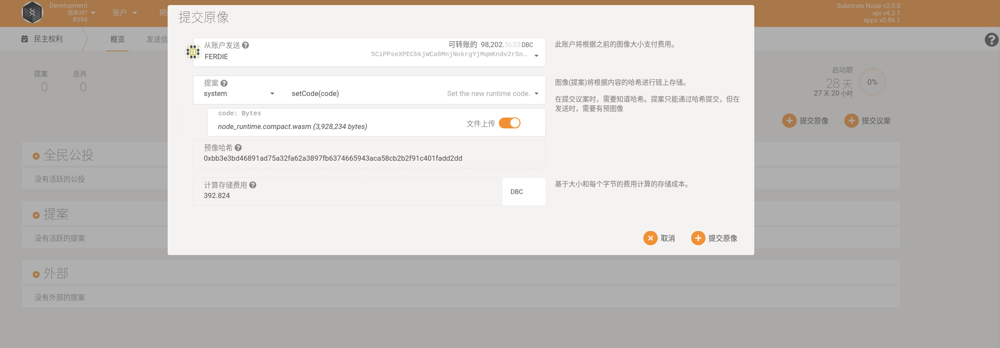
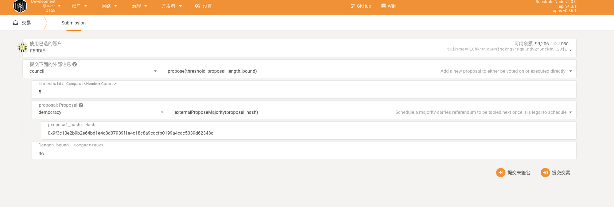
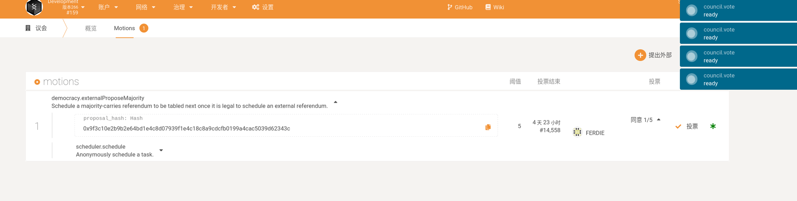
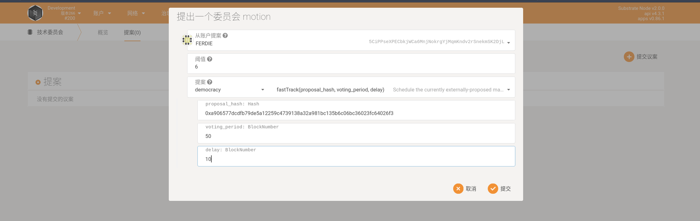

# 快速公投

注意：截图均为测试网截图。其中的数值需要阅读本文档后，再根据情况填写。请不要直接按图片填写。

1. （任何账户均可）到民主模块，提交原象（preimage），如下图，并复制”预像哈希”。如图，进行代码升级。

各个参数填写好后，预像哈希为：

0xbb3e3bd46891ad75a32fa62a3897fb6374665943aca58cb2b2f91c401fadd2dd

2. 议会成员执行下面的调用：注意，主网为 MemberCount 填写 10(至少是议会人数的 3/4)，proposal_hash 填写上一步生成并复制的 Hash

3. 议会会投票，全部通过之后点击 close（关闭）

然后，可以查到存储：

4. 技术委员会提 motion，这里注意：阈值需要是所有技术委员会的个数。

其中，voting_period 即为投票的时间长度，根据实际情况填写。投票开始时间为技术委员会投票完成后执行 close 的时间。

delay 即为投票结束后，代码执行的延迟时间。

执行完后如下：

5. 号召技术委员会来投票，投票完成之后，点击“关闭”

6. 技术委员会投票结束后，公投会开启，通过条件为“简单多数”。

如下图，剩下的即为投票剩余时间。激活即为投票通过后，代码的执行时间。

投票结束后，将会在调度队列中看到即将执行的代码：

