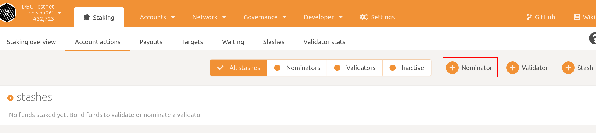
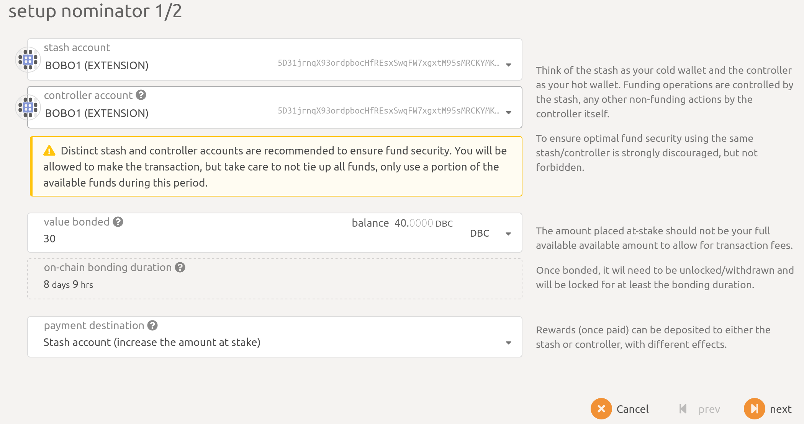
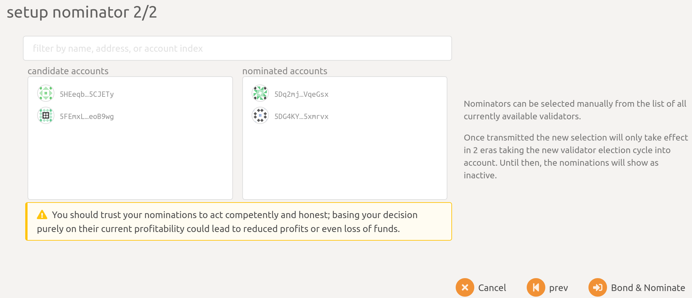
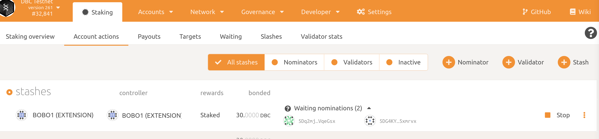

# 成为 DBC 提名人

## 1. 生成资金账户（已有资金账户可以略过）

参考： [如何生成账户](generate-new-account.md)

## 2. 获取一些的 DBC

打开[https://www.dbcwallet.io/?rpc=wss://info.dbcwallet.io#/accounts](https://www.dbcwallet.io/?rpc=wss://info.dbcwallet.io#/accounts), 查看您的账户与余额

## 3. 提名验证人

- 导航到`网络 > 质押 > 账户操作`，点击`提名人`

- 在弹窗中选择存储账户(stash account)，控制账户(controller account)，并填写`绑定的金额(value bonded)`，点击下一步

- 接下来选择您要提名的验证人，点击左侧的账户，或者在输入框中输入地址，将您要提名的验证人添加到右侧（**您可以提名多个验证人**）。

- 最后点击`Bond & Nominate`发送交易，完成提名。

## 4. 查看您提名的结果

导航到`网络 > 质押 > 账户操作`，您可以看到绑定的 DBC 数目，与提名的候选人。

## 5. 第二次提名

`步骤6`的提名实际上包含了两个步骤：`存储账户`设置`控制账户` 和 `提名验证人`。

我们想要再次提名，只需要点击下方的`提名`进行提名这一个步骤即可：

导航到`网络 > 质押 > 账户操作`，在存储账户列表的右边点击`提名`按钮，在弹出的选项中，选择你要提名的验证人。
